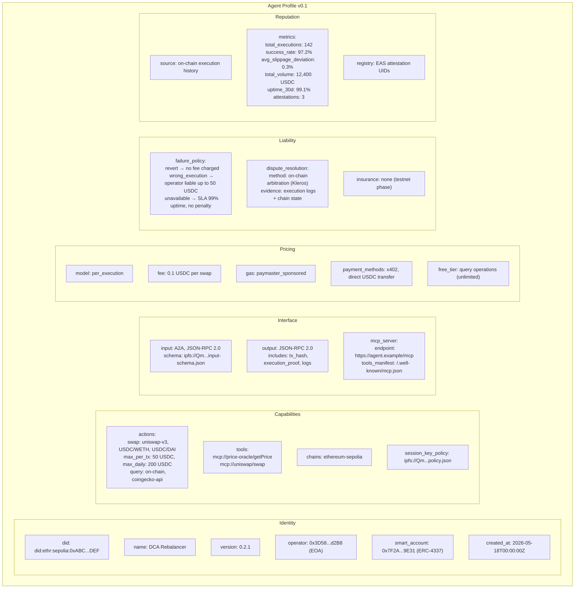
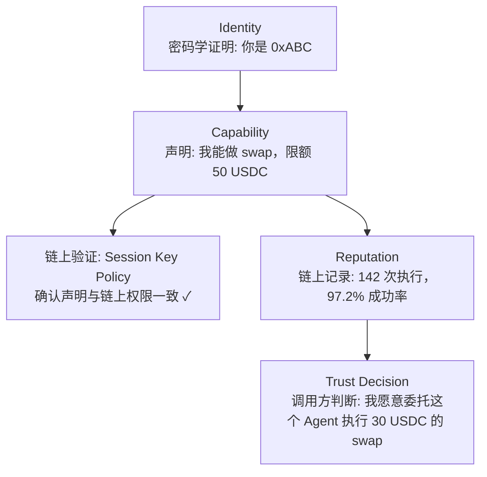
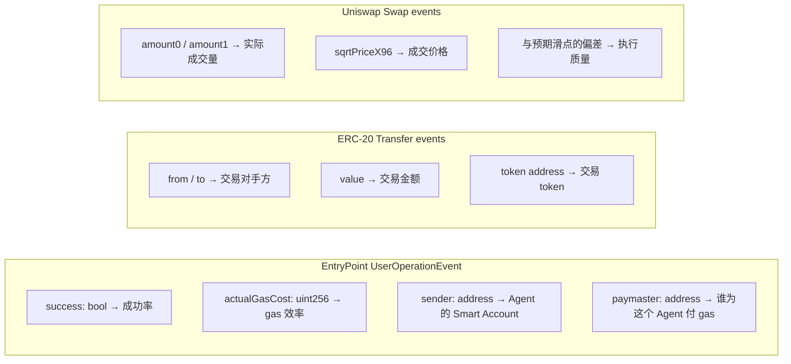
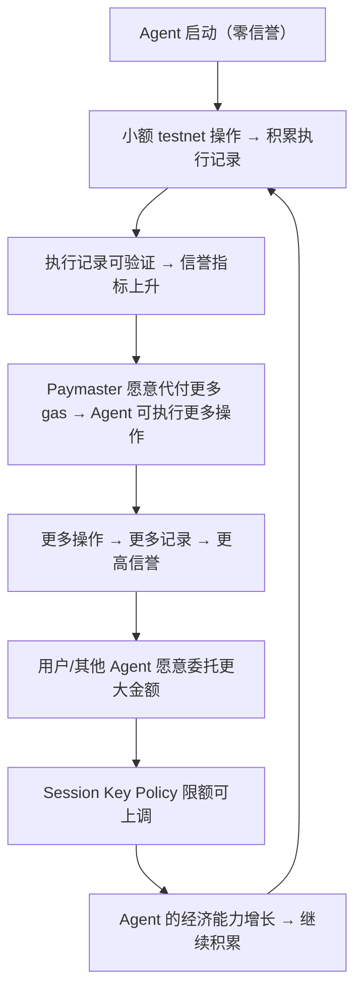
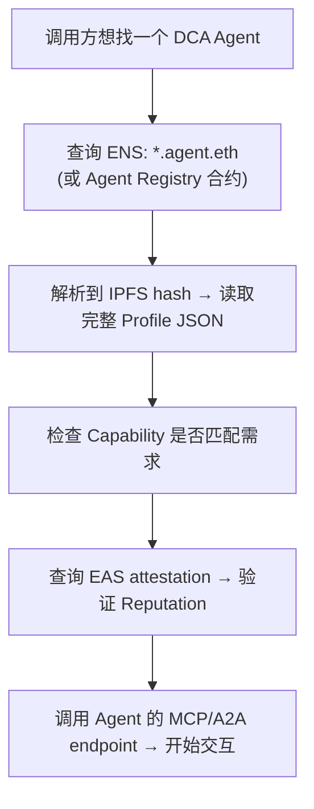

# Agent Profile 与能力声明草图

> Week 2 | Agent Identity | 身份、能力、信誉的设计空间

---

## 1. 为什么 Agent 需要 Profile

Web2 的 API 有 OpenAPI spec，告诉调用方"我能做什么、入参是什么、出参是什么"。但 AI Agent 比 API 复杂得多：

- Agent 的行为是概率性的，不是确定性的
- Agent 会失败，且失败模式不可枚举
- Agent 需要付费和被付费
- Agent 的可信度随执行历史变化

所以需要一个标准化的 Profile 结构，让人、其他 Agent、协议能快速判断："这个 Agent 是谁、能干什么、干得怎么样、出事了谁负责"。

---

## 2. Agent Profile 草图

---

## 3. Identity vs Capability vs Reputation

这三个概念经常被混在一起，但它们回答的问题完全不同：

| 维度 | 回答的问题 | 数据来源 | 可伪造性 | 变化频率 |
|---|---|---|---|---|
| **Identity** | "你是谁？" | DID、链上地址、operator 签名 | 低（密码学绑定） | 几乎不变 |
| **Capability** | "你能做什么？" | Profile 声明 + Session Key Policy | 中（声明可夸大） | 随版本更新 |
| **Reputation** | "你做得怎么样？" | 链上执行记录、第三方 attestation | 低（链上不可篡改） | 持续累积 |

**关键区别**：

- **Identity 是前提，不是信任**。知道一个 Agent 的 DID 不等于信任它。就像知道一个人的身份证号不代表你愿意借钱给他。
- **Capability 是声明，不是保证**。Agent 声明自己能做 swap，但做得好不好、会不会出错，需要 Reputation 来验证。Capability 可以被 Session Key Policy 在链上强制限定（声明了 swap 但 Session Key 只允许 query → 实际 capability 被链上约束）。
- **Reputation 是后验的，不可提前获得**。新 Agent 没有 Reputation，只能通过小额试错积累。这就是为什么需要渐进式信任——先在 testnet 跑，再小额 mainnet，最后才能获得大额委托。

### 三者的信任推导链

---

## 4. 相关协议映射

### MCP (Model Context Protocol)

MCP 定义了 Agent 与 Tool 之间的交互标准。在 Profile 中：
- `tools` 字段列出 Agent 暴露的 MCP tool（Agent 作为 MCP server）
- `mcp_server.endpoint` 是其他 Agent 或客户端调用的入口
- MCP 解决的是 **interface 层** 的标准化——怎么调用，不管信任不信任

### A2A (Agent-to-Agent Protocol)

Google 提出的 A2A 协议关注 Agent 之间的发现和协作：
- Agent Card（类似 Profile）：描述 Agent 的能力、endpoint、认证方式
- Task 生命周期：submitted → working → completed / failed
- A2A 解决的是 **coordination 层** 的标准化——Agent 之间怎么分工

**Profile 中的对应**：A2A 的 Agent Card 可以看作 Profile 的子集。Profile 额外加了 Pricing、Liability、Reputation 这些链上经济相关的字段。

### ERC-8004 (Agent ENS Name)

ERC-8004 提案为 Agent 定义了 ENS 子域名标准，解决"怎么找到一个 Agent"的问题：
- `dca-rebalancer.agent.eth` → 解析到 Profile 的链上 / IPFS 存储地址
- Profile 的 `did` 字段可以与 ENS name 关联
- 但 ERC-8004 本身不定义 capability 或 reputation，只定义 identity 的命名层

### EAS (Ethereum Attestation Service)

EAS 可以用来构建 Reputation：
- Operator 为自己的 Agent 发 attestation："这个 Agent 由我运营，Profile 内容属实"
- 第三方（如 Paymaster 运营商）为 Agent 发 attestation："这个 Agent 在我的 Paymaster 下执行了 100 次零 revert"
- Attestation 的链上不可篡改性让 Reputation 可信

---

## 5. 从链上执行记录构建信誉

这是 5/24 check-in 的核心洞察：链上执行记录本身就是最好的信誉来源，因为它不可伪造、不可删除、公开可验证。

### 可用的链上信号

### 信誉指标计算

| 指标 | 计算方式 | 含义 |
|---|---|---|
| 成功率 | success_count / total_count | 基本可靠性 |
| 执行质量 | avg(actual_slippage - declared_max_slippage) | 声明是否保守/准确 |
| 活跃度 | operations_last_30d | 持续运行而非间歇性 |
| 资金规模 | total_volume_usd | 被信任处理的资金量级 |
| Paymaster 关系 | 是否有知名 Paymaster 持续代付 | 第三方信任背书 |
| 账户年龄 | block.timestamp - first_operation_timestamp | 长期存活 |

### 自增强信任循环

这就是 5/24 check-in 提到的"self-reinforcing trust loop"：

**关键设计约束**：这个循环必须是 **渐进的**。如果允许"突然跳到高限额"，就破坏了循环的安全属性。每次限额上调都应该基于足够的历史数据，而不是单次大额成功。

---

## 6. Profile 的存储与发现

| 层 | 存储内容 | 原因 |
|---|---|---|
| 链上 (ENS + EAS) | Identity (DID → ENS name)、Reputation attestations | 不可篡改、公开可验证 |
| IPFS | 完整 Profile JSON、Session Key Policy | 内容寻址、不可变、低成本 |
| 链下 (API endpoint) | 实时状态（当前剩余限额、在线状态） | 需要实时性，链上存储成本过高 |

**发现流程**：

---

## 7. 开放问题

- **Capability 声明的链上强制**：Profile 里声明"max 50 USDC"，但链上 Session Key Policy 设的是 100 USDC。以谁为准？应该有一个校验层确保声明与链上状态一致。
- **负面信誉**：Agent 执行失败或造成损失，如何在链上记录"扣分"？EAS attestation 目前没有"撤销"语义，只有"revoke"。
- **Agent Profile 的可组合性**：一个 Orchestrator Agent 调用多个 Sub-Agent，Orchestrator 的 Reputation 是否应该继承 Sub-Agent 的指标？
- **隐私与信誉的矛盾**：链上执行记录公开，意味着 Agent 的策略可被逆向工程。ZK proof 能否在不暴露具体操作的前提下证明"成功率 > 95%"？
