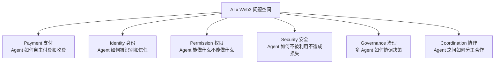
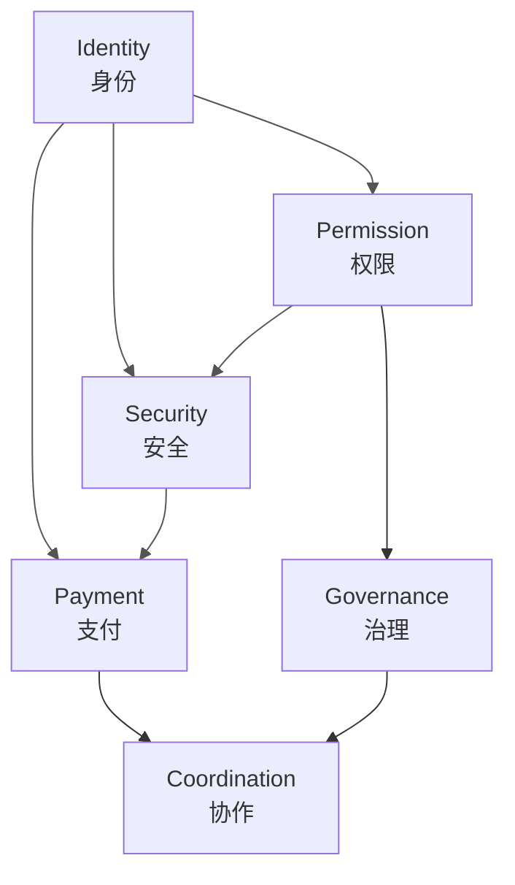
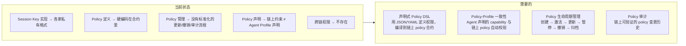
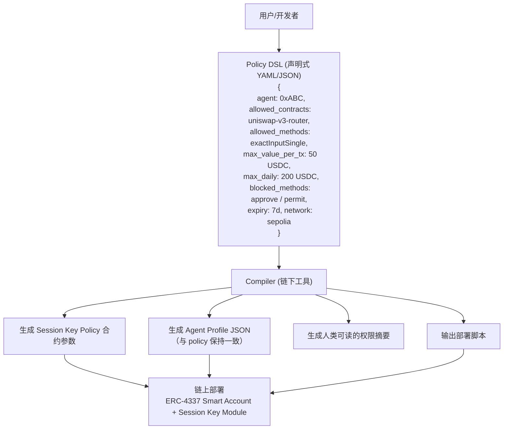
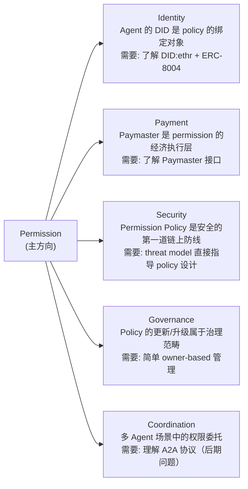

# AI x Web3 问题地图与主方向选择

> Week 2 | 方向研究 | 问题空间全景 + 主赛道分析

---

## 1. 问题地图

AI x Web3 的交叉空间可以拆成六个问题域。每个域解决一个核心矛盾。

### 各域核心矛盾与现有探索

#### Payment（支付）

**核心矛盾**：Agent 需要自主支付，但传统支付基于人类身份验证。

| 现有方案 | 做法 | 局限 |
|---|---|---|
| x402 (Coinbase) | HTTP 402 + 链上 crypto 支付 | 目前只支持 Base 上的 USDC，生态窄 |
| Paymaster (ERC-4337) | 第三方代付 gas | 解决 gas 问题，不解决服务付费 |
| Stripe Agent SDK | Agent 调用 Stripe API 付费 | Web2 路径，需要银行账户 |
| Lightning Network | 微支付通道 | 比特币生态，不直接适配 EVM Agent |

#### Identity（身份）

**核心矛盾**：Agent 需要被识别，但不是人类，传统 KYC/DID 不适用。

| 现有方案 | 做法 | 局限 |
|---|---|---|
| ERC-8004 | Agent ENS subdomain | 提案阶段，只解决命名不解决信任 |
| DID:ethr | 以太坊地址作为 DID | 技术可行，缺乏 Agent 专用语义 |
| Worldcoin / PoP | 人格证明 | Agent 不是人，反而要被区分 |
| Virtuals Protocol | 链上 Agent token + 行为记录 | 与特定平台绑定 |

#### Permission（权限）

**核心矛盾**：Agent 需要足够的权限完成任务，但权限过大会造成不可逆损失。

| 现有方案 | 做法 | 局限 |
|---|---|---|
| Session Key (ERC-4337) | 临时密钥 + policy 约束 | 需要 Smart Account，标准未统一 |
| Safe Module | 模块化权限分配 | 复杂度高，中小团队部署门槛大 |
| OAuth-like (MCP auth) | 类 OAuth 的工具授权 | 链下方案，不能约束链上行为 |
| Permit2 (Uniswap) | 签名授权 + 时间限制 | 只解决 token approval，不解决通用权限 |

#### Security（安全）

**核心矛盾**：Agent 暴露在 prompt injection 和链上攻击的交叉火力下。

| 现有方案 | 做法 | 局限 |
|---|---|---|
| Guardrails (NeMo 等) | 输入/输出过滤 | 纯链下，可被绕过 |
| TEE (Intel SGX / ARM) | 可信执行环境 | 性能开销大，远程证明复杂 |
| 链上 Policy 合约 | Session Key + Guard | 只约束链上行为，链下逻辑无法管 |
| Formal Verification | 合约形式化验证 | 只验证合约，不验证 Agent 逻辑 |

#### Governance（治理）

**核心矛盾**：Agent 参与决策但不承担后果，传统投票治理不适用。

| 现有方案 | 做法 | 局限 |
|---|---|---|
| DAO 投票 (Snapshot/Tally) | Token 加权投票 | 为人设计，Agent 可 sybil |
| Delegation (Governor) | 委托投票权 | 委托给 Agent 后如何撤回？ |
| Optimistic Governance | 默认通过 + 挑战期 | Agent 操作频率远高于人类，挑战窗口不适配 |

#### Coordination（协作）

**核心矛盾**：多 Agent 协作需要信任和分工机制，但链上只有原子交易。

| 现有方案 | 做法 | 局限 |
|---|---|---|
| A2A (Google) | Agent 间 JSON-RPC 协议 | 纯链下，不解决支付和信任 |
| Bittensor | 子网 + Yuma 共识 | 复杂，为 AI 模型评估设计 |
| Autonolas | Agent 服务注册 + 经济模型 | 自有框架绑定 |
| CrewAI / LangGraph | 多 Agent 编排 | 纯软件层，无链上激励 |

---

## 2. 问题域之间的依赖关系

**底层依赖**：Permission 和 Identity 是其他所有域的前置条件。没有可靠的身份识别和权限控制，支付、安全、治理、协作都无法安全运行。

---

## 3. 主方向选择：Permission

### 为什么选 Permission

**三个原因**：

1. **它是最底层的未解决问题**。Identity 有 DID/ENS 基础设施（虽然不完善但能用），Payment 有 Paymaster + x402 在探索，Security 有 guardrails + TEE 在做。但 Permission——特别是"Agent 在什么条件下可以自主执行链上操作"——目前没有一个被广泛采用的标准。Session Key 实现分散在各家 Smart Account（Biconomy、ZeroDev、Kernel），互不兼容。

2. **它是 Week 1 和 Week 2 学习的自然延伸**。Week 1 做了 Restricted Web3 Helper（全手动签名），Week 2 做了 wallet-permission-agent-strategy（Session Key 策略设计）。我对这个问题域有具体的体感，不是纸上谈兵。

3. **它有明确的工程可切入点**。不是"思考一个协议标准"，而是"在现有 ERC-4337 + Session Key Module 上构建一个可用的 Permission Policy DSL"——可以写代码、可以部署、可以测试。

### 现有方案分析

| 方案 | 优势 | 缺口 |
|---|---|---|
| **Biconomy Session Key Module** | 最成熟的 Session Key 实现，支持链上 policy 验证 | Policy 定义是代码级别的，没有声明式 DSL |
| **ZeroDev Permission Plugin** | 支持 Kernel v3，可组合的 validator/executor 架构 | 权限组合的复杂度随 policy 数量指数增长 |
| **Safe + Guard** | 最被信任的多签基础设施 | Guard 是 per-Safe 的，不是 per-Agent 的 |
| **MCP Auth (OAuth-like)** | 标准化的 tool 层授权 | 链下方案，不能约束链上行为 |
| **Lit Protocol Actions** | 可编程签名 + 条件执行 | 依赖 Lit 网络，不是 ERC-4337 原生 |

### 缺口总结

### 可切入点

**最小可行切入：Permission Policy DSL → Session Key Compiler**

**这个切入点的价值**：
- 降低 Session Key Policy 的配置门槛（从写 Solidity 到写 YAML）
- 保证 Agent Profile 声明与链上 policy 的一致性
- 为未来的 Policy 市场（共享/复用常见 policy 模板）打下基础

---

## 4. 与其他方向的交互

选择 Permission 不意味着不碰其他域。Permission 是"主干"，其他域是"必要接口"：

---

## 5. 30 天路线图草案

| 周 | 目标 | 产出 |
|---|---|---|
| Week 2 (当前) | 问题理解 + Policy DSL 设计 | 问题地图、Policy DSL spec 初稿 |
| Week 3 | Compiler MVP | CLI 工具：YAML → Session Key 合约参数 |
| Week 4 | Testnet 部署 + DCA Bot 集成 | Sepolia 上的 DCA Agent 使用 DSL 生成的 policy 运行 |
| Week 5 | Profile 一致性 + 审计 | Agent Profile 自动生成 + policy 变更链上记录 |

---

## 6. 开放问题

- **DSL 的表达力边界**：YAML 能描述"swap 限额 50 USDC"，但能描述"如果 ETH 价格 24h 跌幅 > 10% 则暂停所有操作"吗？条件越复杂，DSL 越接近编程语言，失去声明式的简洁优势。
- **跨链权限**：Agent 在 Ethereum 上有 Session Key，但需要在 Arbitrum 上执行操作。跨链消息传递（如 CCIP）能否传递权限证明？
- **权限的可组合性**：两个 policy 合并后是否会产生意外的权限放大？需要形式化验证还是测试就够了？
