# 治理协作流程草图

> Week 2 | Governance / Coordination | 多 Agent 协作的治理设计

---

## 1. 场景定义：多 Agent DeFi 组合策略

一个用户想实现"跨协议的 yield 优化"：在 Aave、Compound、Uniswap LP 之间动态调配资金，追求最优收益率。单个 Agent 做不好（需要多个协议的专业知识），所以拆成多个 Agent 协作。

### 参与方

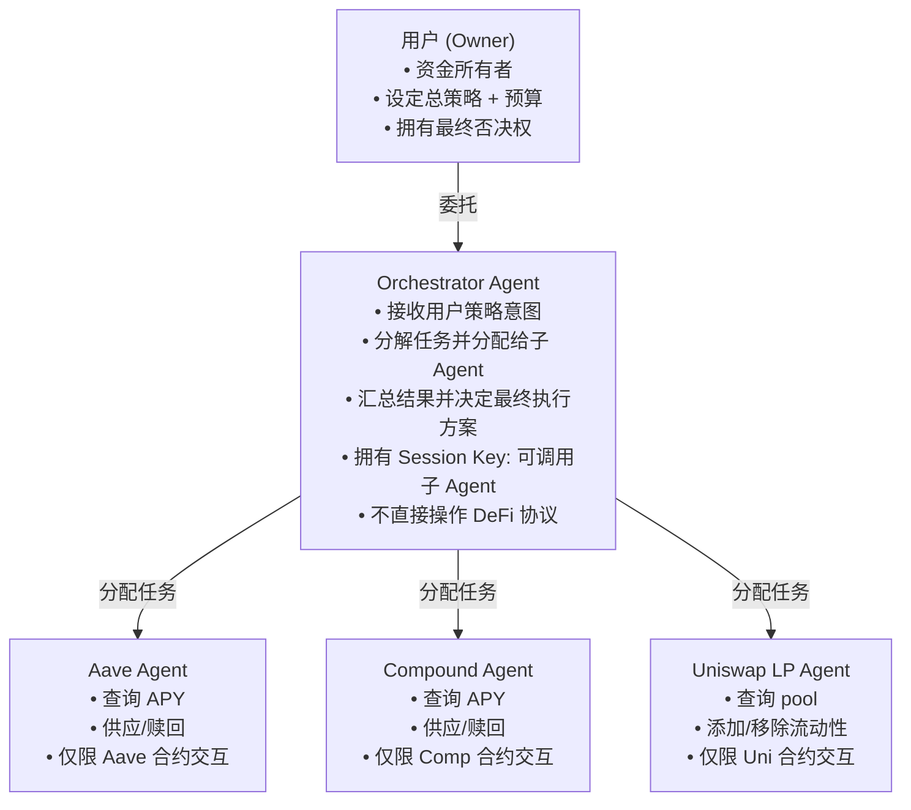

---

## 2. 协作流程

### Phase 1: 任务分配

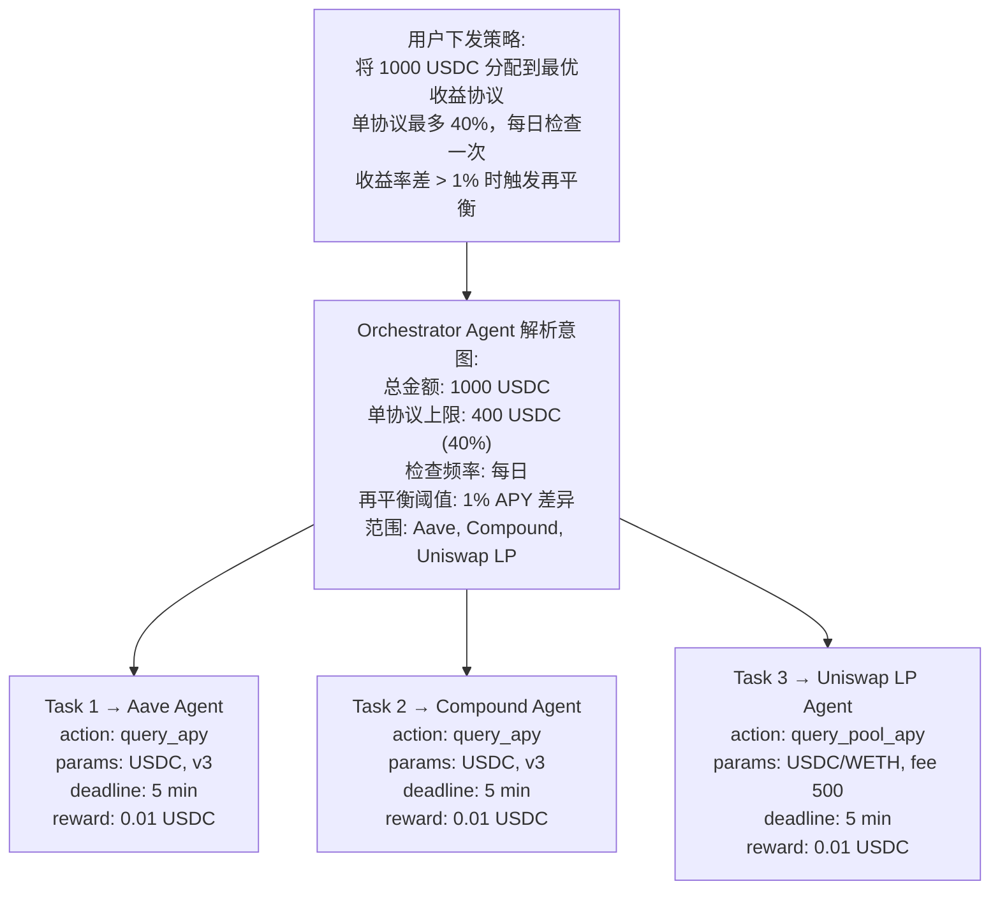

### Phase 2: 并行执行 + 结果汇总

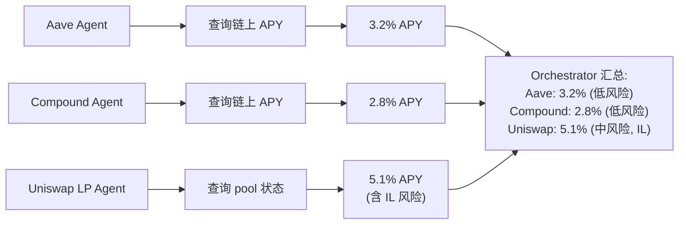

### Phase 3: 决策 + 权限委托

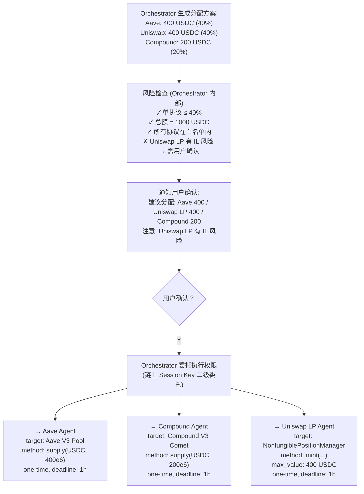

### Phase 4: 结果验证

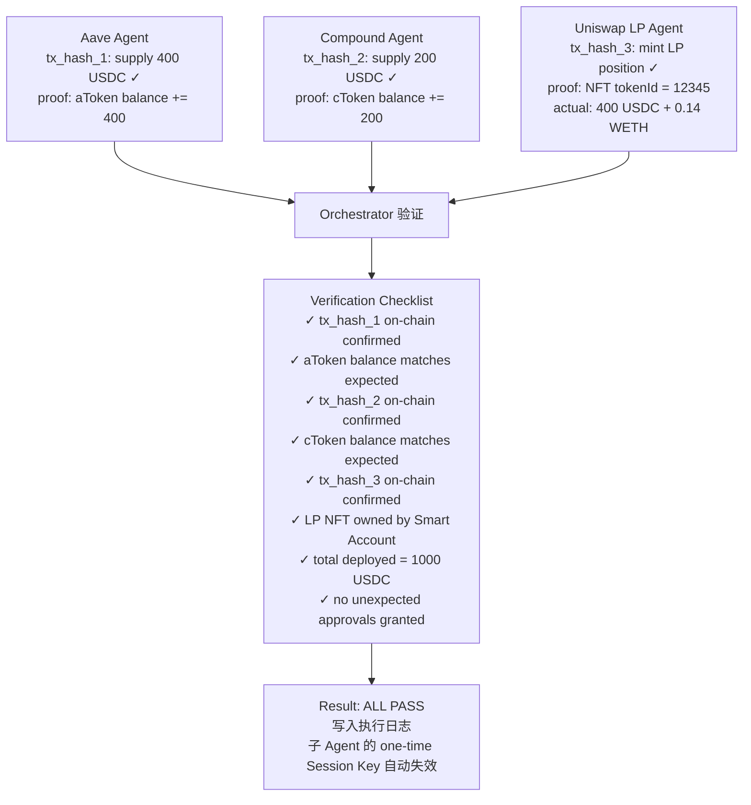

---

## 3. 争议处理流程

多 Agent 协作必然会有执行失败、结果偏差、责任不清的情况。

### 争议类型与处理

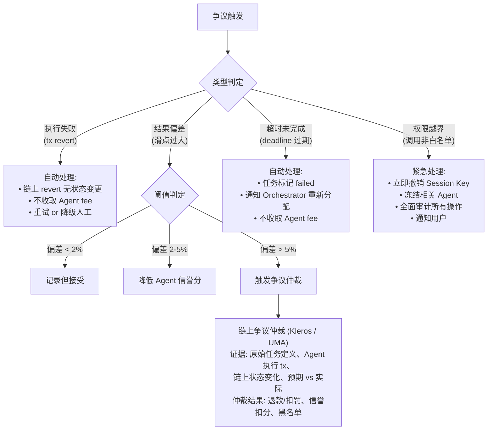

### 责任分层

| 层级 | 责任方 | 承担内容 |
|---|---|---|
| 策略错误 | 用户 + Orchestrator | 方案本身不合理（如全仓 LP 导致 IL 巨大） |
| 执行错误 | 子 Agent | 正确策略但执行有误（如参数填错、调用失败） |
| 基础设施故障 | 无人直接承担 | Bundler 宕机、RPC 不可用、gas spike |
| 协议风险 | 无人直接承担 | Aave 合约被 exploit、Uniswap pool 被操纵 |

关键原则：**Agent 只对自己的执行质量负责，不对底层协议的安全性负责**。但 Agent 有义务在检测到异常时停止操作并报告。

---

## 4. 权限委托的链上实现

多 Agent 协作的核心技术挑战是"权限的安全委托"——Orchestrator 怎么把受限的执行权交给子 Agent，且子 Agent 无法越权。

### 二级 Session Key 委托模型

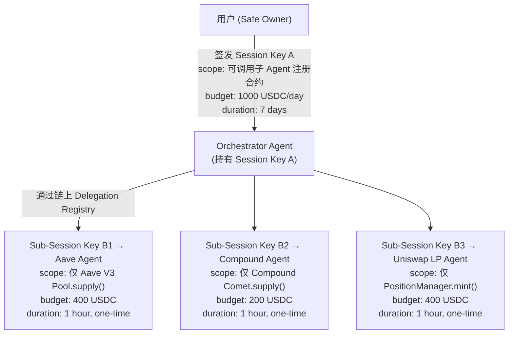

**链上约束保证**：
- 子 Session Key 的权限范围 ⊆ 父 Session Key 的权限范围（不能越权委托）
- 子 Session Key 的预算 ≤ 父 Session Key 的剩余预算
- 子 Session Key 的有效期 ≤ 父 Session Key 的剩余有效期
- one-time 标记确保子 Agent 用完即废，不能重复执行

### Delegation Registry 合约（伪代码）

```solidity
// 简化示意，非完整实现
contract DelegationRegistry {
    struct Delegation {
        address parent;      // 父 Session Key 持有者
        address child;       // 子 Agent 地址
        address target;      // 允许调用的合约
        bytes4 selector;     // 允许调用的方法
        uint256 maxValue;    // 最大金额
        uint256 deadline;    // 过期时间
        bool oneTime;        // 是否一次性
        bool used;           // 是否已使用
    }

    // validateUserOp 时检查:
    // 1. child 是否有 parent 签发的有效 delegation
    // 2. delegation 的 scope 是否覆盖当前操作
    // 3. parent 的 Session Key 本身是否仍然有效
}
```

---

## 5. DAO 治理工具与 Agent 协作的结合点

### 5.1 现有 DAO 工具的局限

| 工具 | 设计假设 | Agent 协作的不适配 |
|---|---|---|
| Snapshot | 人类投票，每次提案间隔数天 | Agent 决策频率是分钟级，不可能每次投票 |
| Tally / Governor | Token 加权，链上执行 | Agent 没有治理 token，无投票权 |
| Gnosis Safe | M-of-N 签名 | 签名者是人，确认时间不适配 Agent 速度 |
| Aragon | 组织管理框架 | 为人类组织设计，权限模型不支持 Session Key |

### 5.2 需要的适配

**核心洞察**：Agent 协作不是"DAO 投票"，而是"受约束的自动执行 + 异常时人工介入"。治理的角色从"每次决策都参与"变成"设定规则 + 监督 + 争议处理"。

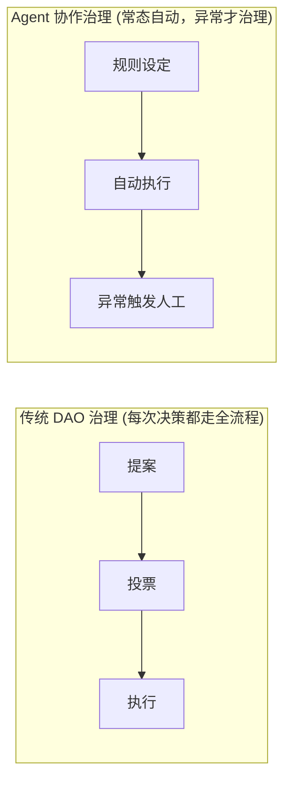

### 5.3 结合点

| 结合点 | DAO 工具提供 | Agent 协作需要 |
|---|---|---|
| **规则设定** | Governor 提案 + 投票修改参数 | Session Key Policy 的参数（限额、白名单）通过 DAO 投票更新 |
| **Agent 注册** | Registry 合约（类似 ENS） | 新 Agent 加入协作需要 DAO 审批（投票 + 质押） |
| **预算分配** | Treasury 管理（Safe） | DAO Treasury 向 Paymaster deposit 注资，控制总 gas 预算 |
| **异常仲裁** | 争议解决（Kleros / UMA） | Agent 执行偏差超过阈值时，提交争议给链上仲裁 |
| **升级治理** | Proxy 升级投票 | Orchestrator 的策略逻辑升级需要 DAO 投票批准 |
| **信誉管理** | Attestation（EAS） | DAO 成员为 Agent 发 attestation，建立链上信誉 |

### 5.4 一个具体结合示例

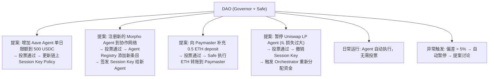

---

## 6. 完整协作流程图

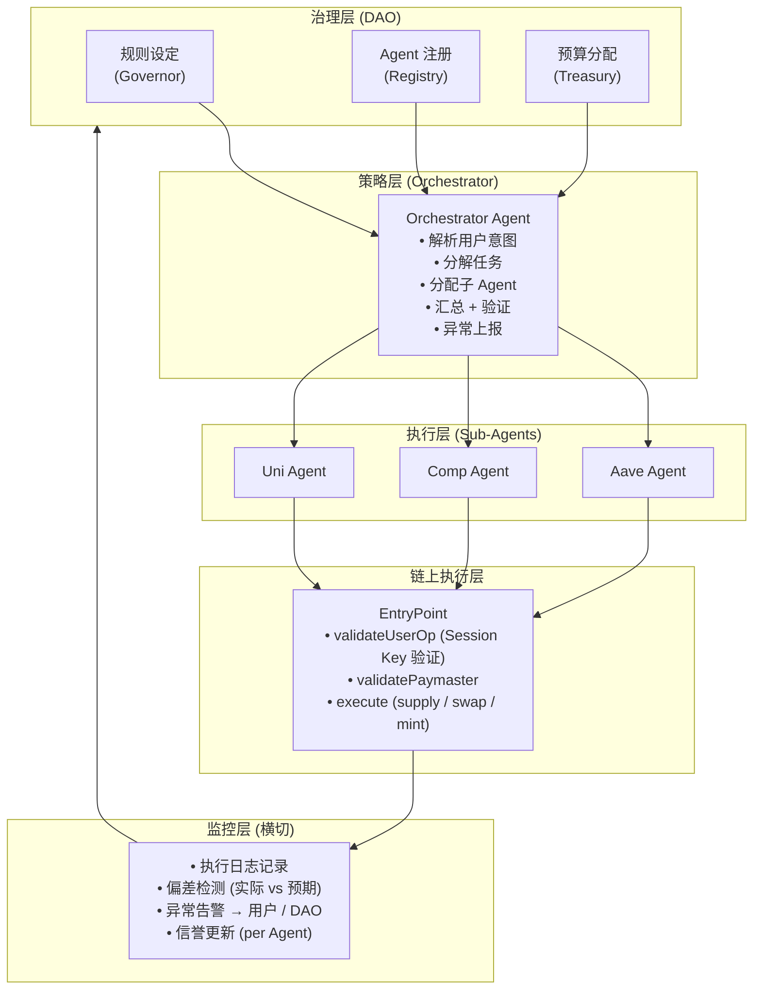

---

## 7. 5/23 Check-in 的回应：表达力 vs 约束

5/23 讨论了"Expressiveness vs Containment"的张力——Agent 能做的事越多越有用，但风险也越大。多 Agent 协作放大了这个张力：

### Rule-driven vs Intent-driven

| 维度 | Rule-driven (当前阶段) | Intent-driven (未来方向) |
|---|---|---|
| 任务定义 | "在 Aave V3 上 supply 400 USDC" | "把 40% 资金放到最优借贷协议" |
| Orchestrator 角色 | 路由器（把预定义任务分给预定义 Agent） | 规划器（理解意图后自主拆解任务） |
| 子 Agent 自由度 | 只执行特定合约+方法 | 可在协议范围内自主选择最优路径 |
| Session Key Policy | 精确到 method selector | 精确到协议级别，方法由 Agent 决定 |
| 风险 | 低（路径固定） | 中（Agent 有策略自由度） |
| 上限 | 低（不能适应市场变化） | 高（可以动态优化） |

### 产品演进路径

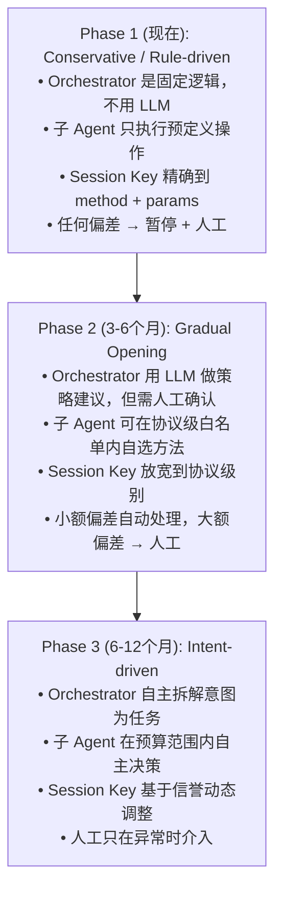

每个 Phase 的过渡条件：上一个 Phase 积累了足够的链上执行记录 + 信誉数据，证明 Agent 在受限范围内是可靠的。这就是 5/24 的"自增强信任循环"在协作场景中的应用。

---

## 8. 开放问题

- **Orchestrator 的单点风险**：所有协作都经过 Orchestrator，它被攻破 = 整个系统被攻破。去中心化的 Orchestrator 怎么做？多个 Orchestrator 的共识机制？
- **子 Agent 之间的利益冲突**：Aave Agent 和 Compound Agent 可能各自"推销"自己的协议（因为操作越多 fee 越多）。如何保证 Orchestrator 的决策不被子 Agent 的"偏见"影响？
- **跨时区/跨链的协作**：Aave 在 Ethereum，Compound 在 Arbitrum，Uniswap 在 Optimism。跨链操作的原子性如何保证？失败时如何回滚已成功的链？
- **治理速度与 Agent 速度的失配**：DAO 投票需要 3-7 天，Agent 操作是分钟级。紧急情况（如协议被 exploit）如何快速治理响应？Guardian 机制 vs Optimistic Governance 的权衡。
