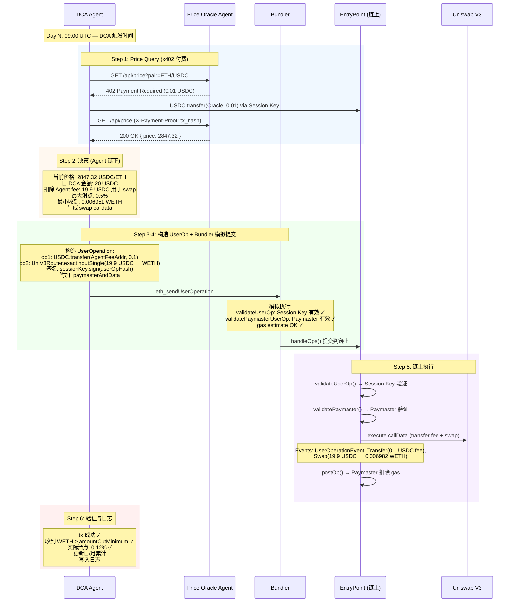
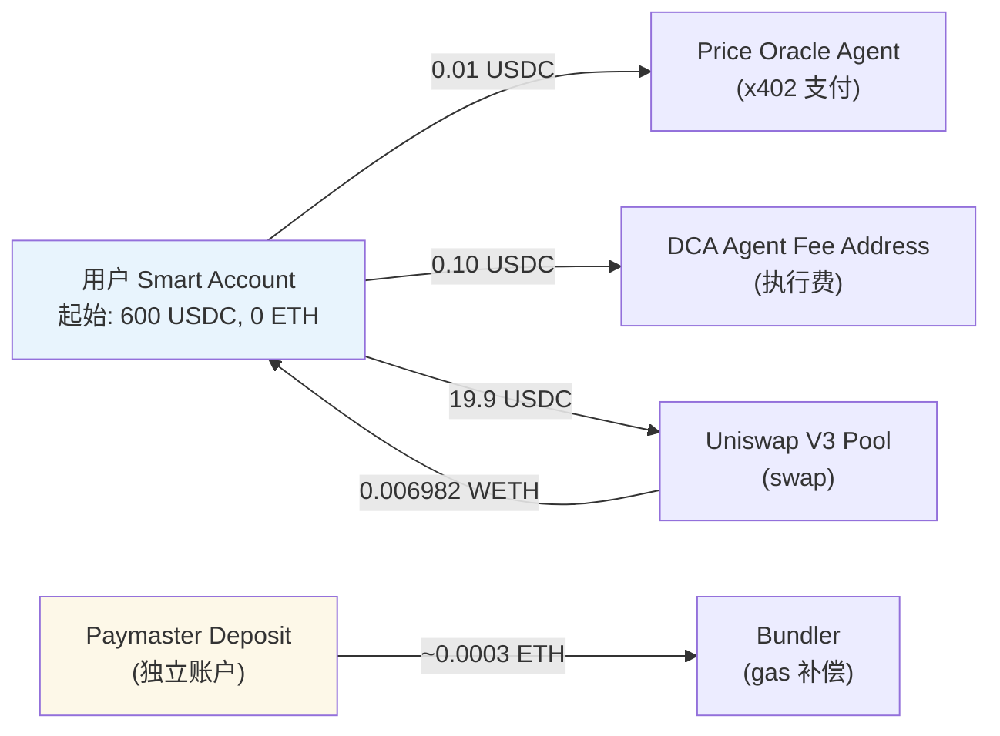
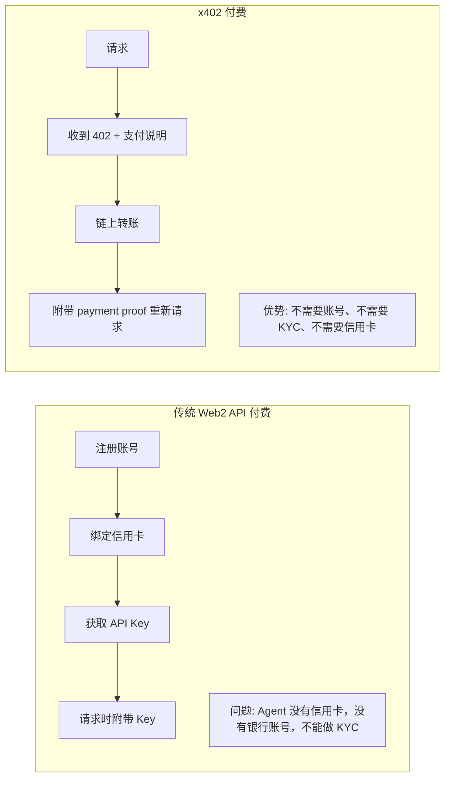
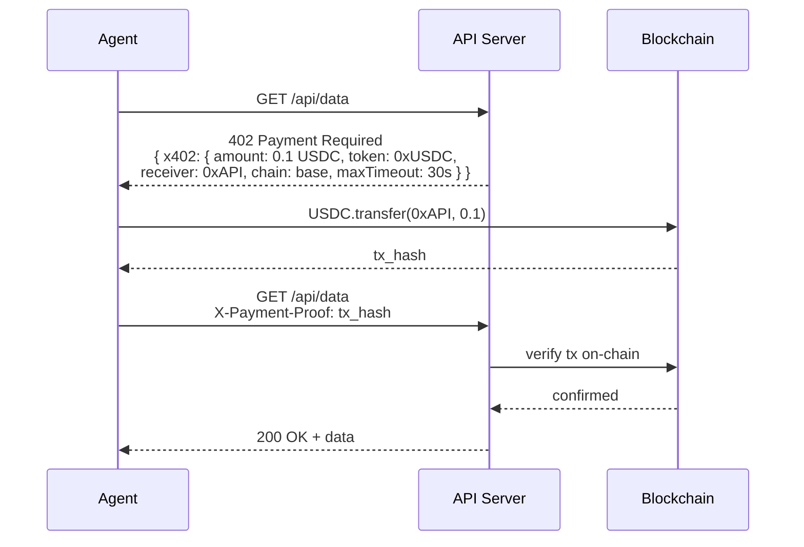
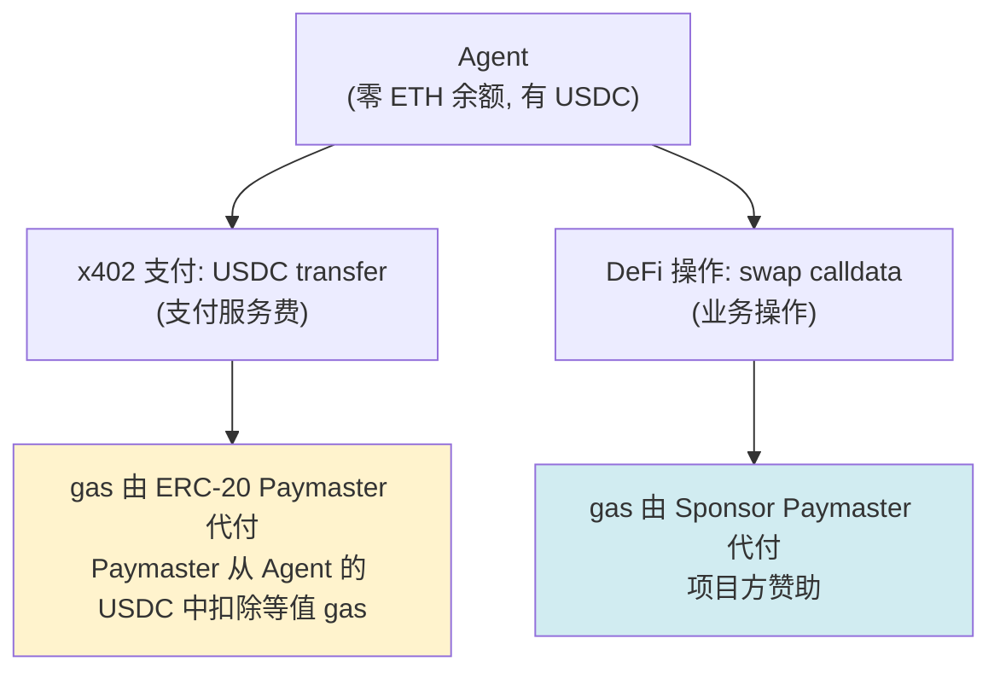
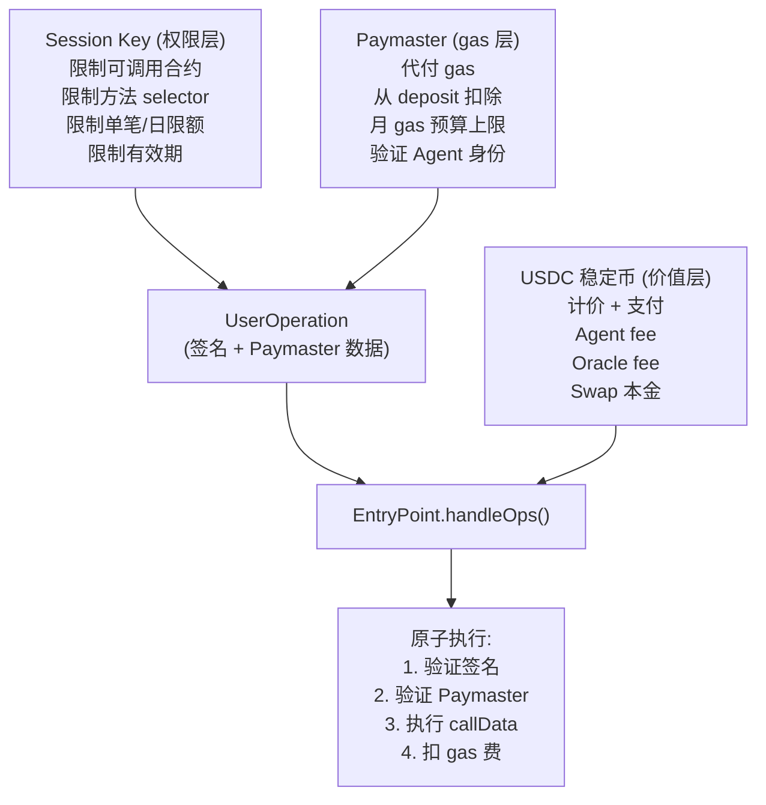

# 最小支付与商业流程拆解

> Week 2 | Payment / Commerce | AI Agent 自主支付的完整路径

---

## 1. 最小商业场景定义

场景：一个 DCA (Dollar Cost Averaging) Agent 每天自动买入一定数量的 ETH。

**参与方**：
- **用户**：资金所有者，委托 Agent 执行 DCA
- **DCA Agent**：执行 swap 操作的 AI Agent
- **Price Oracle Agent**：提供价格数据的 Agent（被 DCA Agent 调用）
- **Uniswap V3**：链上 DEX（执行层）
- **Paymaster**：代付 gas 的第三方服务
- **Bundler**：打包 UserOperation 的节点

**经济流**：
- 用户预存 USDC 到 Smart Account
- DCA Agent 用 Session Key 执行 swap（USDC → WETH）
- Paymaster 代付 gas（从 Paymaster deposit 中扣除）
- Price Oracle Agent 对每次价格查询收费 0.01 USDC（通过 x402 协议）
- DCA Agent 对每次成功执行收费 0.1 USDC（从 swap 金额中扣除）

---

## 2. 支付流程图

---

## 3. 资金流全景

**净结果**:
- 用户: -20.01 USDC, +0.006982 WETH
- DCA Agent: +0.10 USDC
- Price Oracle: +0.01 USDC
- Paymaster: -0.0003 ETH (从 deposit 扣除)

---

## 4. Paymaster 经济模型

### 4.1 三种 Paymaster 模式

Paymaster 是 ERC-4337 的"gas 代付"机制。5/22 check-in 的核心洞察：Paymaster 让 Agent 可以零余额运行，不需要持有 ETH。

```mermaid
flowchart TD
    subgraph M1["模式 1: Sponsor Paymaster (赞助模式)"]
        A1["DApp / DAO\n(赞助方)"] -- "deposit" --> B1["Paymaster\n(链上合约)"]
        B1 -- "代付 gas" --> C1["Agent Smart Account\n(零 ETH 余额)"]
    end

    subgraph M2["模式 2: ERC-20 Paymaster (Token 支付模式)"]
        A2["Agent Smart Account\n(有 USDC)"] -- "USDC" --> B2["Paymaster\n(链上合约)"]
        B2 -- "代付 gas (用自己的 ETH)" --> A2
        B2 --> D2["Paymaster 盈利 =\n收到 USDC - 支付 ETH gas\n(含汇率差 markup)"]
    end

    subgraph M3["模式 3: Subscription Paymaster (订阅模式)"]
        A3["用户 / 项目方"] -- "月费 5 USDC" --> B3["Paymaster Service"]
        B3 -- "限额内免费使用" --> C3["该用户的所有 Agent\n月限: 1000 次操作或 0.5 ETH gas"]
    end
```

- **模式 1 适用**: 项目方为用户的 Agent 代付 gas 以降低使用门槛。收入: 无直接收入。风险: deposit 耗尽 → Agent 停摆
- **模式 2 适用**: Agent 持有稳定币但不持有 ETH。收入: 汇率差 markup (5-15%)。风险: ETH/USDC 汇率剧烈波动
- **模式 3 适用**: 高频 Agent 操作场景。收入: 订阅费 - 实际 gas 成本。风险: 操作量超预期 → 亏损

### 4.2 Paymaster 对 Agent 设计的影响

Paymaster 不只是"gas 代付工具"，它重新定义了 Agent 的经济约束：

| 没有 Paymaster | 有 Paymaster |
|---|---|
| Agent 必须持有 ETH | Agent 可以零 ETH 余额 |
| Agent 钱包是"有价值"的攻击目标 | Agent 钱包只有操作权限，没有 ETH |
| gas 波动直接影响 Agent 运行成本 | gas 成本被 Paymaster 抽象掉 |
| Agent 需要"加油"逻辑 | Agent 只关心业务逻辑 |
| 多链部署需要每条链充 ETH | Paymaster 可以在多链部署 |

**5/22 check-in 的延伸**：Paymaster 让 Agent 的"经济身份"从"持有资产的实体"变成"被授权操作的代理"。这在安全上是巨大进步——Agent 被攻破后，攻击者拿到的是一把限额的 Session Key，而不是一个有余额的钱包。

---

## 5. x402 协议分析

### 5.1 设计思路

x402 是 Coinbase 提出的协议，把 HTTP 402 (Payment Required) 状态码与链上 crypto 支付结合。

**核心思想**：Web 上的任何 API endpoint 都可以变成"付费才能访问"的资源。Agent 访问时收到 402 → 自动支付 → 获得响应。

### 5.2 协议流程

### 5.3 x402 的优势与局限

**优势**：
- **无身份要求**：Agent 只需要有链上地址和余额，不需要注册、KYC、API Key
- **按次计费**：每次请求独立支付，无预付、无订阅
- **可组合**：任何 HTTP 服务都可以加上 x402 支持
- **透明定价**：价格在 402 响应中明确告知，没有隐藏费用
- **Agent 原生**：为 Agent 自主支付设计，不需要人工介入

**局限**：
- **延迟**：每次请求需要等链上确认（即使 Base 的 2s 出块也比 API Key 慢）
- **成本效率**：每次都是链上 tx，gas 成本可能远超服务本身费用（0.1 USDC 服务费 + 0.05 USDC gas 费 = 50% overhead）
- **生态**：目前只支持 Base 上的 USDC，其他链/token 需要扩展
- **退款**：链上支付不可逆，服务质量不达标时没有退款机制（需要额外的争议解决层）
- **批量优化**：高频调用不适合每次都链上支付，需要 payment channel 或预付 + 结算模式

### 5.4 x402 + Paymaster 的结合

两种 Paymaster 可以在同一个 Agent 中并存：服务调用用 ERC-20 Paymaster (Agent 自付)，业务操作用 Sponsor Paymaster (项目方付)。

---

## 6. 最小商业流程中的三个关键组件交互

### Session Key + Paymaster + 稳定币

**三者缺一不可**：
- 没有 Session Key → Agent 需要 owner 私钥，太危险
- 没有 Paymaster → Agent 需要持有 ETH，增加攻击面
- 没有稳定币 → 支付金额随 ETH 波动，不可预测

---

## 7. 开放问题

- **x402 的 payment channel 优化**：高频调用场景（如 Agent 每分钟查一次价格）是否可以引入 state channel，批量结算而非每次链上支付？
- **Paymaster 的信任模型**：Agent 依赖 Paymaster 运行，Paymaster 宕机 = Agent 停摆。如何设计 fallback（多 Paymaster 备份？自持 ETH 降级模式？）
- **跨链支付**：Agent 在 Ethereum 上操作，但服务提供方只接受 Base 上的 USDC。需要跨链桥 + Paymaster 的组合，复杂度急剧上升。
- **微支付经济性**：0.01 USDC 的服务费 + 0.05 USDC 的 gas 费 → 80% 以上的成本是 gas。L2 gas 降低后这个比例会改善，但在 gas spike 时仍然不经济。
