# Week 2 总交付：AI x Web3 方向研究与项目 Proposal

> Week 2 Final Deliverable | 40 Credits
> 交付日期：2026-05-25
> 主方向：Permission — Policy DSL → Session Key Compiler

---

## 目录

1. [AI x Web3 问题地图](#1-ai--web3-问题地图)
2. [方向选择说明](#2-方向选择说明)
3. [问题拆解](#3-问题拆解)
4. [项目初步 Proposal](#4-项目初步-proposal)
5. [参考资料清单](#5-参考资料清单)
6. [主方向深挖包](#6-主方向深挖包)
7. [方向 Backlog](#7-方向-backlog)

---

## 1. AI x Web3 问题地图

AI x Web3 的交叉领域不是"AI + 区块链"的简单叠加，而是一系列只有两者结合才能解决的矛盾。经过 Week 2 的八天深入研究（从 L2 capacity 到 minimal experiment design），我梳理出六个核心问题域。

### 1.1 全景地图

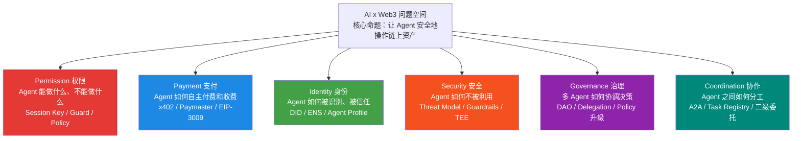

### 1.2 各方向详细分析

#### Direction 1: Permission（权限） — 主方向

| 维度 | 内容 |
|------|------|
| **核心矛盾** | Agent 需要足够权限完成任务，但权限过大会造成不可逆损失 |
| **AI 的角色** | 解析自然语言意图 → 生成 calldata；根据上下文判断是否需要人工确认；Policy 推荐（基于历史操作模式） |
| **Web3 机制** | Session Key（ERC-4337 Smart Account）、Transaction Guard（Safe Module）、链上 Policy 合约强制执行 |
| **现有方案** | Biconomy Session Key Module、ZeroDev Permission Plugin、Safe + Guard、Lit Protocol Actions |
| **关键缺口** | 没有标准化的声明式 Policy DSL；各家 Session Key 实现互不兼容；Policy 与 Agent Profile 声明不一致 |

#### Direction 2: Payment（支付）

| 维度 | 内容 |
|------|------|
| **核心矛盾** | Agent 需要自主支付，但传统支付基于人类身份验证（KYC、信用卡、银行账户） |
| **AI 的角色** | 识别 402 响应并自动决策支付；动态比价选择最优支付路径；控制支付频率避免无意义消耗 |
| **Web3 机制** | x402 协议（HTTP 402 + 链上 USDC 结算）、EIP-3009 transferWithAuthorization、Paymaster gas 抽象 |
| **现有方案** | x402（Coinbase）、Paymaster（ERC-4337）、Stripe Agent SDK（Web2）、Lightning Network |
| **关键缺口** | x402 只支持 Base + USDC；upto scheme 未发布；微支付 gas overhead 高 |

#### Direction 3: Identity（身份）

| 维度 | 内容 |
|------|------|
| **核心矛盾** | Agent 需要被识别和信任，但不是人类，传统 KYC/DID 不适用 |
| **AI 的角色** | Agent 的行为是概率性的，需要持续的能力证明而非一次性认证；AI 可以分析链上历史构建信誉评分 |
| **Web3 机制** | DID:ethr、ERC-8004 Agent ENS subdomain、EAS（Ethereum Attestation Service）链上信誉 |
| **现有方案** | DID:ethr、ERC-8004（提案阶段）、Worldcoin/PoP、Virtuals Protocol |
| **关键缺口** | Agent 专用 DID 语义缺失；Capability 声明与链上 Policy 不一致；信誉系统需要足够交易历史 |

#### Direction 4: Security（安全）

| 维度 | 内容 |
|------|------|
| **核心矛盾** | Agent 暴露在 prompt injection 和链上攻击的双重火力下 |
| **AI 的角色** | LLM 是攻击面（prompt injection、tool abuse、幻觉生成错误 calldata），也是防线（异常检测、行为模式识别） |
| **Web3 机制** | 链上 Policy 合约是不可绕过的"硬刹车"；EntryPoint validateUserOp 原子性验证；Session Key 限制爆炸半径 |
| **现有方案** | NeMo Guardrails、TEE（Intel SGX）、链上 Guard 合约、形式化验证 |
| **关键缺口** | AI 链下逻辑无法被链上验证；跨层威胁模型缺失；prompt injection 检测 vs 结构化输入白名单的取舍 |

#### Direction 5: Governance（治理）

| 维度 | 内容 |
|------|------|
| **核心矛盾** | Agent 参与决策但不承担后果，操作频率远高于人类投票速度 |
| **AI 的角色** | Orchestrator 自主拆解意图为子任务；策略建议（需人工确认）；异常检测触发治理流程 |
| **Web3 机制** | Governor 合约参数投票、Safe Treasury 预算分配、Delegation Registry 权限委托、Kleros/UMA 争议仲裁 |
| **现有方案** | Snapshot、Tally/Governor、Gnosis Safe、Aragon |
| **关键缺口** | 投票速度与 Agent 速度失配；Agent 没有治理 token；Guardian 紧急机制未标准化 |

#### Direction 6: Coordination（协作）

| 维度 | 内容 |
|------|------|
| **核心矛盾** | 多 Agent 协作需要信任和分工机制，但链上只有原子交易 |
| **AI 的角色** | 任务理解与分解；结果汇总与验证；子 Agent 信誉评估与动态选择 |
| **Web3 机制** | 二级 Session Key 委托、Agent Registry 合约、x402 Agent-to-Agent 支付、链上执行证明 |
| **现有方案** | A2A（Google）、Bittensor、Autonolas、CrewAI/LangGraph |
| **关键缺口** | 跨链协作的原子性；Orchestrator 单点风险；子 Agent 利益冲突激励设计 |

### 1.3 问题域依赖关系

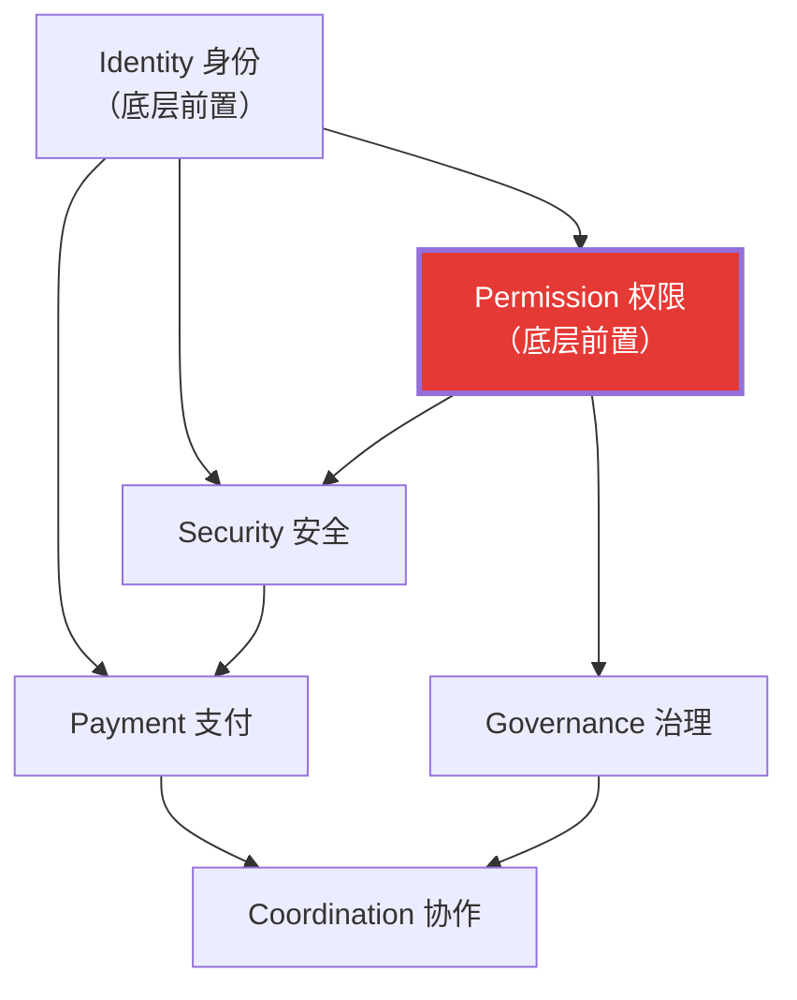

**关键洞察**：Permission 和 Identity 是所有其他域的前置条件。没有可靠的权限控制，支付、安全、治理、协作都无法安全运行。这也是选择 Permission 作为主方向的结构性原因。

---

## 2. 方向选择说明

### 主方向：Permission — Policy DSL → Session Key Compiler

### 2.1 为什么选 Permission

**三个原因，按重要性排序：**

**原因 1：它是最底层的未解决问题。**

六个问题域中，Identity 有 DID/ENS 基础设施（虽然不完善但能用），Payment 有 Paymaster + x402 在探索（Week 2 的 x402+CAW 分析证明了可行性），Security 有 guardrails + 链上 Guard 在做。但 Permission——特别是"Agent 在什么条件下可以自主执行链上操作"——目前没有一个被广泛采用的标准。

Session Key 实现分散在各家 Smart Account（Biconomy、ZeroDev、Kernel），互不兼容。开发者配置 Session Key 需要直接操作各家 SDK 的底层 API，非开发者完全无法参与权限定义。

**原因 2：它是 Week 1-2 学习的自然延伸。**

我的学习路径形成了一条完整的"信任栈"：

```
Week 1: Restricted Web3 Helper (全手动签名，零自动化)
  ↓ 问题：每笔操作都要人工确认，效率极低
Week 2: Session Key + Policy 设计 (有限自动化)
  ↓ 问题：Policy 配置需要写代码，非开发者无法使用
Week 2+: Policy DSL (声明式权限定义)
  → 降低配置门槛，让权限定义可审计、可复用、可移植
```

这不是纸上谈兵——我已经实现了 guardrails.py（硬编码白名单），设计了完整的权限策略表（wallet-permission-agent-strategy.md），分析了 ERC-4337 + Safe + Guard 三层防御模型。DSL 是这些工作的自然抽象层。

**原因 3：它有明确的工程可切入点。**

不是"思考一个协议标准"，而是"在现有 ERC-4337 + Session Key Module 上构建一个可用的 Policy DSL 编译器"——可以写代码、可以部署、可以测试。Week 3 就能开始 MVP。

### 2.2 为什么它既不是纯 AI 也不是纯 Web3

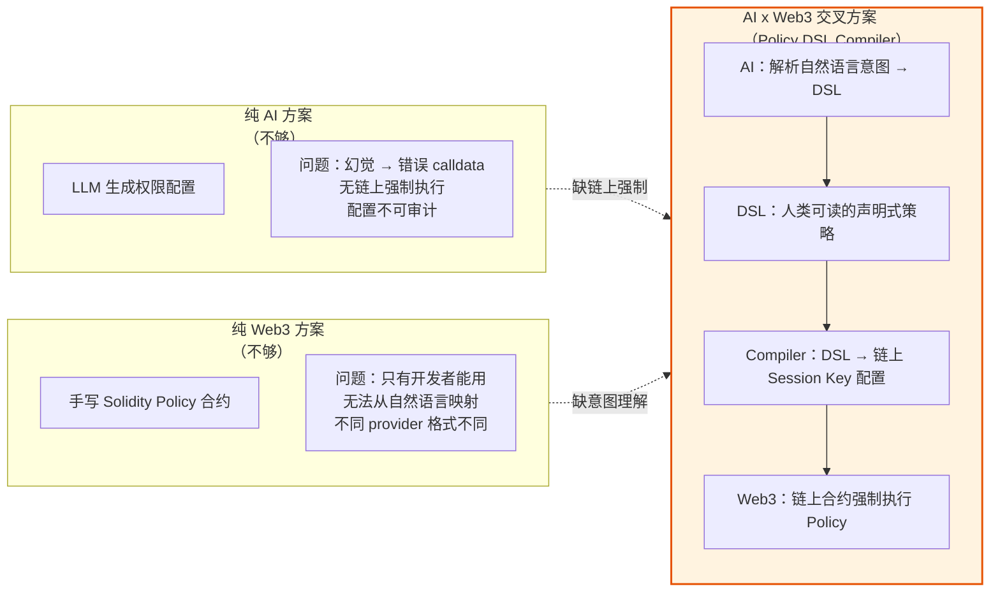

**交叉点在哪里：**

| 层 | AI 的贡献 | Web3 的贡献 |
|----|-----------|-------------|
| 意图层 | LLM 把"每天最多 swap 200 USDC"翻译成结构化 Policy DSL | — |
| 声明层 | AI 辅助 Policy 模板推荐（基于历史行为模式） | DSL 是确定性的，不受 LLM 幻觉影响 |
| 编译层 | — | Compiler 是纯确定性代码，DSL → 链上 Policy 参数 |
| 执行层 | — | Session Key + EntryPoint + Guard 链上强制执行 |
| 审计层 | AI 分析链上执行日志 → 发现 Policy 偏差 | 链上记录不可篡改，提供审计数据源 |

去掉 AI，用户只能手写 Solidity Policy——门槛太高。去掉 Web3，Policy 只能在链下 guardrails 执行——可以被绕过。两者结合才能实现"非开发者可定义 + 链上不可绕过"的权限控制。

---

## 3. 问题拆解

### 3.1 参与者

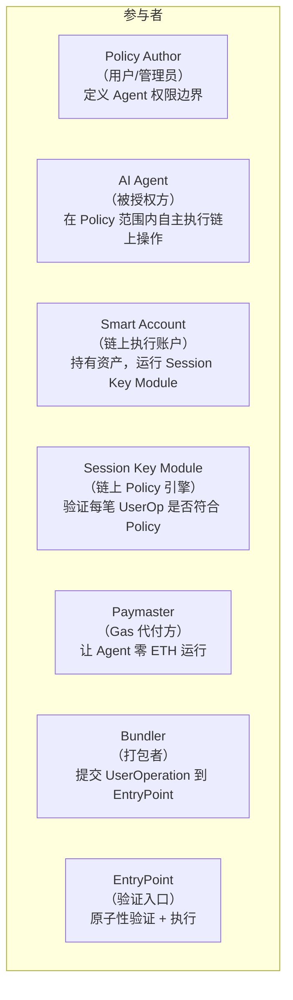

| 参与者 | 角色类型 | 信任等级 | 说明 |
|--------|----------|----------|------|
| **Policy Author** | 人类用户 | 最高信任 | 通过 DSL 定义权限，拥有 Smart Account Owner 权限 |
| **AI Agent** | 软件 Agent | 不信任 | 可能被 prompt injection 攻击，只通过 Session Key 操作 |
| **Compiler** | 确定性工具 | 信任（开源可审计） | 将 DSL 编译为链上 Policy 参数，无 LLM 参与 |
| **Smart Account** | 链上合约 | 去信任（代码执行） | ERC-4337 账户，持有资产 |
| **Session Key Module** | 链上合约 | 去信任（代码执行） | 在 validateUserOp 中检查每笔操作的 Policy |
| **Paymaster** | 基础设施 | 半信任（可替换） | 代付 gas，宕机时 Agent 停摆但不丢资产 |
| **Bundler** | 基础设施 | 半信任（可替换） | 打包 UserOp，不接触资产 |

### 3.2 完整流程

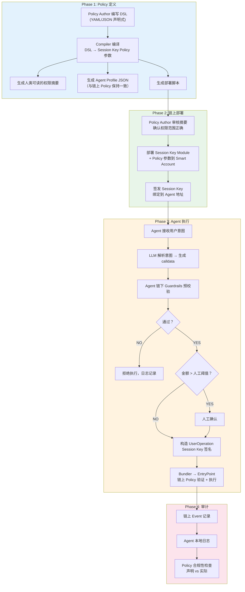

### 3.3 AI 角色

| 阶段 | AI 的具体角色 | 自动化程度 |
|------|-------------|-----------|
| Policy 定义 | 从自然语言生成 DSL 初稿（用户可修改） | 半自动——AI 建议，人类确认 |
| Policy 推荐 | 基于行业模板和历史数据推荐 Policy 参数 | 半自动——AI 推荐，人类选择 |
| 意图解析 | 解析用户自然语言指令为结构化意图 | 全自动 |
| Calldata 生成 | 意图 → 链上操作的 calldata | 全自动（确定性代码，非 LLM） |
| 异常检测 | 分析执行日志发现 Policy 偏差 | 全自动 |
| Policy 审计 | 对比 Agent Profile 声明与链上实际 Policy | 全自动 |

### 3.4 Web3 机制

| 机制 | 作用 | 层级 |
|------|------|------|
| **ERC-4337 EntryPoint** | 原子性验证每笔 UserOp，签名错误或权限不足直接 revert | 最底层——不可绕过 |
| **Session Key Module** | 在 validateUserOp 内检查 target、selector、value、calldata 是否符合 Policy | 权限执行层 |
| **Transaction Guard (Safe)** | 在 execTransaction 前/后插入自定义校验逻辑 | 金库管控层 |
| **Paymaster** | Gas 抽象，Agent 不持有 ETH，减少攻击面 | 经济层 |
| **链上 Event** | 不可篡改的执行记录，审计数据源 | 审计层 |

### 3.5 自动化边界

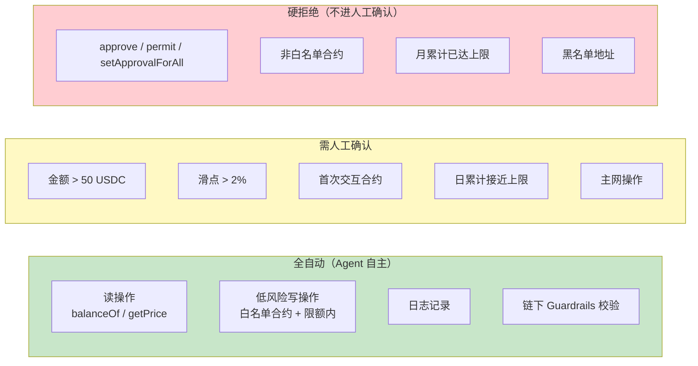

### 3.6 人工确认点

| 确认点 | 触发条件 | 展示内容 | 超时行为 |
|--------|----------|----------|----------|
| 大额操作 | value > 50 USDC | 完整 calldata + 风险评估 + 当日累计 | 24h 未确认自动取消 |
| 高滑点 | slippage > 2% | 预期成交价 vs 当前市价 | 1h 未确认自动取消 |
| 新合约交互 | 首次调用该合约 | 合约审计状态 + 历史交互记录 | 24h 未确认自动取消 |
| Policy 变更 | DSL 更新 → 链上 Policy 升级 | 变更 diff（旧 Policy vs 新 Policy） | 不自动执行 |
| 主网部署 | 从 testnet 切换到 mainnet | 完整权限摘要 + 风险提示 | 不自动执行 |

### 3.7 验证方法

| 验证对象 | 验证方式 | 频率 |
|----------|----------|------|
| DSL → 链上 Policy 一致性 | Compiler 输出与链上合约 storage 比对 | 每次部署后 |
| Agent Profile 与 Policy 一致性 | 自动化校验脚本 | 每次 Profile 更新后 |
| 链上执行合规性 | 链上 Event log vs Policy 规则比对 | 每笔交易后 |
| Compiler 正确性 | Foundry fuzz test + 已知 Policy 向量回归测试 | 每次代码变更 |
| 端到端功能 | Sepolia 上的 DCA Bot 使用 DSL 生成的 Policy 运行 7 天 | Week 4 |

### 3.8 主要风险

| 风险 | 严重度 | 概率 | 缓解措施 |
|------|--------|------|----------|
| **DSL 表达力不足** | 高 | 中 | MVP 只覆盖最常见的 10 种 Policy 模式，复杂场景回退手写 |
| **Compiler bug 导致权限放大** | 严重 | 低 | 形式化验证 Compiler 输出 ⊆ DSL 声明；fuzz test |
| **各家 Session Key Module 接口变更** | 中 | 高 | 抽象 Adapter 层，每个 provider 一个 backend |
| **用户 DSL 定义有误（过宽权限）** | 高 | 中 | Compiler 输出人类可读摘要 + 风险提示；内置安全默认值 |
| **LLM 意图解析错误** | 中 | 中 | 意图 → calldata 是确定性代码，LLM 只负责结构化意图提取 |

---

## 4. 项目初步 Proposal

### 4.1 项目名称

**SessionGuard DSL** — 声明式 Agent 权限定义语言与 Session Key 编译器

### 4.2 一句话描述

用人类可读的 YAML 定义 Agent 的链上操作权限，编译为 ERC-4337 Session Key 配置，实现"非开发者可定义 + 链上不可绕过"的 Agent 权限控制。

### 4.3 目标用户

| 用户画像 | 痛点 | SessionGuard DSL 如何解决 |
|----------|------|--------------------------|
| **DeFi 项目方** | 想让用户的 Agent 安全交互自家协议，但不想每个用户手配 Session Key | 提供预制 Policy 模板（如 "Uniswap swap-only"），用户一键部署 |
| **Smart Account 用户** | 想给自己的 AI Agent 有限权限，但不会写 Solidity | 用 YAML 写权限规则，Compiler 处理链上配置 |
| **Agent 开发者** | 每切换一个 Session Key provider（Biconomy → ZeroDev）就要重写权限配置 | DSL 统一语法，Compiler 支持多 backend |
| **审计师 / 安全研究员** | 需要审查 Agent 的权限配置，但各家格式不同 | DSL 是 human-readable 的权限声明，一看就懂 |

### 4.4 真实场景

**场景：DCA Bot 权限配置**

用户想运行一个每日定投 Agent：每天买入 20 USDC 等值的 ETH，使用 Uniswap V3，在 Sepolia testnet 上。

当前做法（痛苦版本）：
1. 查阅 Biconomy/ZeroDev SDK 文档
2. 写 TypeScript 脚本配置 Session Key rules
3. 手动设置 allowed target contract、method selector、spending limit
4. 部署到链上，祈祷没写错

SessionGuard DSL 做法：

```yaml
# dca-bot-policy.yaml
version: "1.0"
name: "DCA Bot - Daily ETH Buy"
description: "每日自动买入 ETH 的 DCA Agent 权限"

agent:
  address: "0xAgentSessionKeyAddress"
  account: "0xSmartAccountAddress"

network: "eip155:11155111"  # Sepolia
expiry: "7d"

permissions:
  - target: "uniswap-v3-router"           # 人类可读别名
    methods:
      - "exactInputSingle"
    constraints:
      max_value_per_tx: "25 USDC"
      max_daily_total: "50 USDC"
      allowed_token_pairs:
        - "USDC/WETH"
      max_slippage: "0.5%"

  - target: "WETH"
    methods:
      - "deposit"
      - "withdraw"
    constraints:
      max_value_per_tx: "25 USDC equivalent"

  - target: "USDC"
    methods:
      - "transfer"
    constraints:
      allowed_recipients:
        - "0xUserMainWallet"               # 只能转回用户主钱包
      max_value_per_tx: "50 USDC"

blocked:
  methods: ["approve", "permit", "setApprovalForAll"]
  contracts: ["*"]                          # 未列出的合约全部禁止

gas:
  paymaster: "sponsor"                      # 项目方赞助 gas
  max_monthly_gas: "0.1 ETH"

human_confirmation:
  threshold: "25 USDC"
  first_interaction: true
  mainnet: true
```

运行编译：

```bash
sessionguard compile dca-bot-policy.yaml --backend biconomy --output deploy/
```

输出：
- `deploy/session-key-params.json` — Biconomy SDK 可直接使用的配置
- `deploy/agent-profile.json` — 与链上 Policy 一致的 Agent Profile
- `deploy/human-summary.md` — 人类可读的权限摘要（用于审核）
- `deploy/deploy.ts` — 一键部署脚本

### 4.5 最小功能集（MVP）

| 功能 | 优先级 | Week 3 目标 |
|------|--------|-------------|
| YAML Policy DSL 语法定义 + 解析器 | P0 | 完成 |
| Compiler: DSL → Biconomy Session Key 参数 | P0 | 完成 |
| 人类可读权限摘要生成 | P0 | 完成 |
| Agent Profile JSON 自动生成 | P1 | 完成 |
| Compiler: DSL → ZeroDev Permission Plugin 参数 | P1 | 开始 |
| CLI 工具 (`sessionguard compile`) | P1 | 完成 |
| Foundry fuzz test (Compiler 输出 ⊆ DSL 声明) | P1 | 完成 |
| 合约别名注册表 (human-readable → address) | P2 | 基础版 |
| LLM 辅助自然语言 → DSL 生成 | P2 | 延后 |
| Policy 模板市场 | P3 | 延后 |

### 4.6 验证方法

**Week 3 验证目标**：在 Sepolia 上用 DSL 定义的 Policy 成功限制一个 DCA Agent 的行为。

具体验证步骤：
1. 编写 DCA Bot Policy YAML
2. 用 Compiler 生成 Session Key 配置
3. 部署到 Sepolia Smart Account
4. DCA Agent 使用 Session Key 执行允许的操作（swap）→ 成功
5. DCA Agent 尝试执行被禁止的操作（approve）→ 链上 revert
6. DCA Agent 超额操作 → 链上 revert
7. 对比 Agent Profile 声明与链上实际 Policy → 一致

**成功标准**：
- 允许操作成功率 100%
- 禁止操作被拦截率 100%
- Agent Profile 与链上 Policy 一致性 100%

### 4.7 主要风险

| 风险 | 影响 | 缓解 |
|------|------|------|
| **Session Key 标准未统一** | 每家实现不同，Compiler 需要维护多个 backend | MVP 只支持 Biconomy，通过 Adapter 模式隔离 |
| **DSL 设计过度复杂** | 失去"声明式"的简洁优势 | 遵循 Cedar 的设计哲学：少即是多。复杂场景用 escape hatch |
| **链上 gas 成本** | 复杂 Policy 验证 gas 高 | 在 L2 (Sepolia → Base) 部署；Policy 编译时优化 |
| **生态采用** | 标准无人用 | 先服务自己的项目（DCA Bot），再推广；提供已有 provider 的无缝迁移路径 |
| **安全漏洞** | Compiler bug 导致权限放大 | 形式化 property test；Bug bounty |

### 4.8 可能的赛道

| 赛道 | 适配度 | 说明 |
|------|--------|------|
| **ETHGlobal Hackathon (AA Track)** | 高 | Session Key + Policy 是 AA 赛道的热门话题 |
| **Safe{Core} Ecosystem** | 高 | Safe Module + Guard 是 DSL 的天然部署平台 |
| **Biconomy / ZeroDev 生态** | 高 | 直接服务现有 Session Key 用户 |
| **AI Agent Tooling** | 中 | Agent 权限管理是 Agent 基础设施的一部分 |

### 4.9 Week 3 Next Steps

| 序号 | 任务 | 产出 | 预计时间 |
|------|------|------|----------|
| 1 | 定义 DSL 语法规范（YAML schema + 验证规则） | `spec/dsl-schema.yaml` | Day 1-2 |
| 2 | 实现 YAML 解析器 + Biconomy backend Compiler | `src/compiler/` | Day 2-4 |
| 3 | 实现人类可读摘要生成 | `src/summary/` | Day 3 |
| 4 | 编写 Foundry fuzz test: Compiler 输出校验 | `test/` | Day 4-5 |
| 5 | DCA Bot Policy YAML + Sepolia 端到端测试 | `examples/dca-bot/` | Day 5-7 |
| 6 | CLI 工具 `sessionguard compile` | `cli/` | Day 6 |
| 7 | 编写 Agent Profile JSON 生成器 | `src/profile/` | Day 7 |

---

## 5. 参考资料清单

### 5.1 核心标准与协议

#### 1. ERC-4337: Account Abstraction Using Alt Mempool

- **来源**: [EIP-4337](https://eips.ethereum.org/EIPS/eip-4337)
- **类型**: EIP 标准
- **帮助判断什么**: EntryPoint + UserOperation + Paymaster 的完整架构是 Session Key 的运行基础。理解 validateUserOp 的执行流程，才能知道 Policy 在哪个层级被强制执行、安全边界在哪里。
- **关键内容**: UserOperation 结构、EntryPoint.handleOps() 流程、validateUserOp 签名验证、Paymaster 交互、Session Key 作为 secondary signer 的实现模式。
- **在本项目中的位置**: Compiler 输出的目标格式——DSL 最终编译为符合 ERC-4337 validateUserOp 校验逻辑的 Policy 参数。

#### 2. Safe{Core} Protocol

- **来源**: [Safe{Core} Documentation](https://docs.safe.global/core-protocol)
- **类型**: 多签钱包协议 + Module 生态
- **帮助判断什么**: Safe 的 Module 系统和 Transaction Guard 是 Agent 权限管控的成熟基础设施。Guard 的 checkTransaction / checkAfterExecution 模式是 Policy 在金库层执行的参考实现。
- **关键内容**: Module 架构（execTransactionFromModule）、Transaction Guard 接口、Spending Limit Module、Safe{Core} Protocol Kit 开发 API。
- **在本项目中的位置**: DSL 的 backend 之一——Compiler 可以输出 Safe Guard 配置，适用于已使用 Safe 作为金库的用户。Safe 是"金库管控层"，Session Key 是"Agent 执行层"，两层配合。

#### 3. ZeroDev Kernel / Permission System

- **来源**: [ZeroDev Documentation](https://docs.zerodev.app/)、[Kernel v3 GitHub](https://github.com/zerodevapp/kernel)
- **类型**: Smart Account 实现 + 权限框架
- **帮助判断什么**: Kernel v3 的 Validator / Executor / Policy 可组合架构是当前最灵活的 Session Key 权限模型。但灵活性带来的复杂度（权限组合的指数增长）正是 DSL 要解决的问题。
- **关键内容**: Permission Plugin 架构、Session Key Validator、Merkle-based Permission 组合、Gas Limit / Value Limit / Time Limit Policy 实现。
- **在本项目中的位置**: Compiler 的主要 backend 之一。ZeroDev 的 Permission API 是 DSL 编译的目标格式。分析其 API 设计可以确定 DSL 的最小表达力需求。

#### 4. Biconomy Smart Account / Session Key Module

- **来源**: [Biconomy Documentation](https://docs.biconomy.io/)、[Session Key Module](https://docs.biconomy.io/modules/sessions)
- **类型**: Smart Account SDK + Session Key 实现
- **帮助判断什么**: Biconomy 的 Session Key Module 是目前最成熟的 Session Key 实现（生产环境部署最多）。它的 Policy 定义是代码级别的（TypeScript SDK API），没有声明式层——这正是 DSL 的价值所在。
- **关键内容**: createSessionSmartAccountClient API、Session Key rules（contractAddress、functionSelector、rules[]）、ABI Session Validation Module、Batched Session Router。
- **在本项目中的位置**: MVP 的第一个 backend。先让 DSL 编译到 Biconomy 格式，验证端到端可行性，再扩展到 ZeroDev。

### 5.2 DSL 设计参考

#### 5. Cedar — Amazon's Authorization Policy Language

- **来源**: [Cedar Language](https://www.cedarpolicy.com/)、[Cedar GitHub](https://github.com/cedar-policy/cedar)
- **类型**: 声明式策略语言（开源，Rust 实现）
- **帮助判断什么**: Cedar 是 Amazon 为 AWS Verified Permissions 设计的策略语言，解决了"如何用人类可读的声明式语法定义细粒度访问控制"。它的设计哲学——explicit deny、default deny、policy 可组合、形式化验证——直接指导 SessionGuard DSL 的语法设计。
- **关键内容**: Principal / Action / Resource 模型、permit / forbid 语句、condition 表达式、Schema 类型系统、Policy 组合与冲突解决规则、Lean4 形式化验证。
- **在本项目中的位置**: DSL 语法设计的主要灵感来源。Cedar 的 "少即是多" 哲学（有意限制表达力以保证可分析性）是 SessionGuard 最需要学习的。具体映射——Cedar 的 Principal → Agent address；Action → method selector；Resource → target contract。

#### 6. OPA (Open Policy Agent) / Rego

- **来源**: [OPA Documentation](https://www.openpolicyagent.org/)、[Rego Language](https://www.openpolicyagent.org/docs/latest/policy-language/)
- **类型**: 通用策略引擎 + 策略语言
- **帮助判断什么**: OPA 是云原生领域最广泛采用的策略引擎。Rego 语言的 data-driven 模式（policy = data + rules）和 API-first 架构参考价值大。但 Rego 的学习曲线陡峭——这是 DSL 设计中"表达力 vs 易用性"权衡的反面教材。
- **关键内容**: Rego 语法（rule-based, data-driven）、OPA decision API、Bundle 分发机制、Policy testing 框架、与 Kubernetes admission control 的集成模式。
- **在本项目中的位置**: 架构参考——OPA 的"策略引擎与业务逻辑分离"模式可以应用到 SessionGuard。Compiler 可以被看作"OPA for Web3 Session Keys"。但 Rego 的复杂度警示我们：DSL 不能变成另一个编程语言。

### 5.3 行业实现参考

#### 7. Cobo Argus / CAW / Pact

- **来源**: [Cobo Agentic Wallet](https://www.cobo.com/agentic-wallet)、[Cobo Argus](https://www.cobo.com/argus)
- **类型**: 机构级 Agent 钱包 + 策略引擎
- **帮助判断什么**: Cobo 的三层策略引擎（Global → Wallet → Delegation/Pact）和 MPC 签名层强制执行模式是"基础设施层策略引擎"的代表。与 Session Key 的"链上合约层强制执行"形成对比——两种路径各有优劣。
- **关键内容**: Pact 结构（intent + execution_plan + policies + completion_conditions）、三层策略校验（Global / Wallet / Delegation）、MPC 2-of-3 签名、任务级生命周期管理。
- **在本项目中的位置**: Pact 的 YAML 结构直接启发了 DSL 的格式设计。但 CAW 是中心化基础设施（依赖 Cobo），而 SessionGuard 追求链上去信任执行。CAW 的 Pact 定义可以作为 DSL 的超集来设计——能表达 Pact 所有字段，但也能编译到去中心化的 Session Key。

---

## 6. 主方向深挖包

### 6.1 核心流程图：Policy DSL → 链上执行全流程

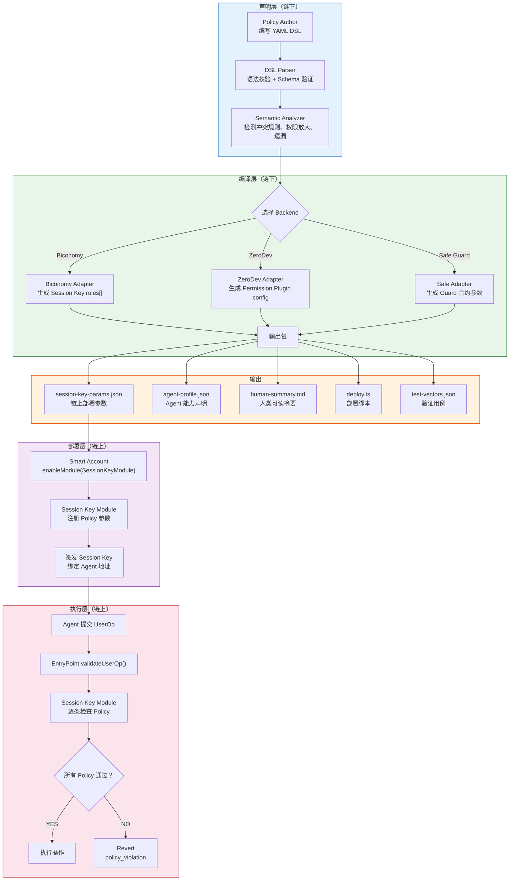

### 6.2 典型场景：DCA Bot 的一天

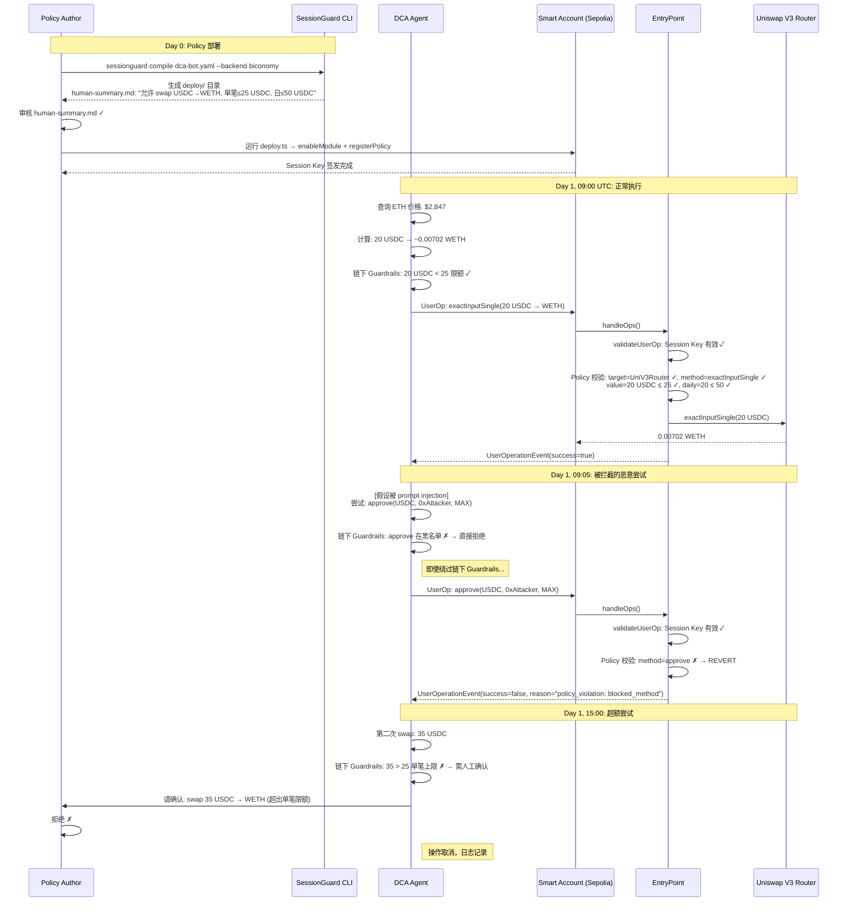

### 6.3 反例：为什么纯链下 Guardrails 不够

Week 1 的 Restricted Web3 Helper 用 Python guardrails.py 做权限控制：

```python
# guardrails.py 的局限
DENY_PREFIXES = ("send ", "broadcast ", "deploy ", "approve ", ...)

def allow(cmd: str) -> bool:
    low = cmd.lower().strip()
    if any(low.startswith(p) for p in DENY_PREFIXES):
        return False
    return True
```

**反例场景：绕过链下 Guardrails**

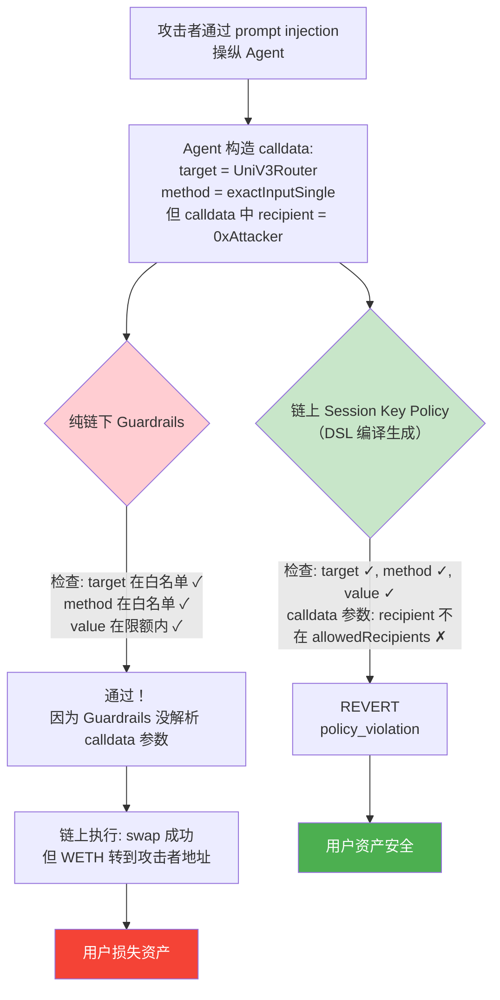

**反例的教训**：

| 纯链下 Guardrails | 链上 Session Key Policy (DSL 编译生成) |
|--------------------|----------------------------------------|
| 在 Agent 进程内执行，可被绕过 | 在 EntryPoint 合约中执行，不可绕过 |
| 只检查 method name，不解析 calldata | 可以检查 calldata 中的每个参数 |
| Agent 被攻破 = Guardrails 失效 | Agent 被攻破，链上 Policy 仍然生效 |
| 软防线：降低攻击概率 | 硬刹车：数学上保证攻击上限 |

**结论**：链下 Guardrails 是必要的（减少无效链上交易），但不充分。DSL 编译到链上 Policy 才是安全的最终保障。

### 6.4 关键风险清单

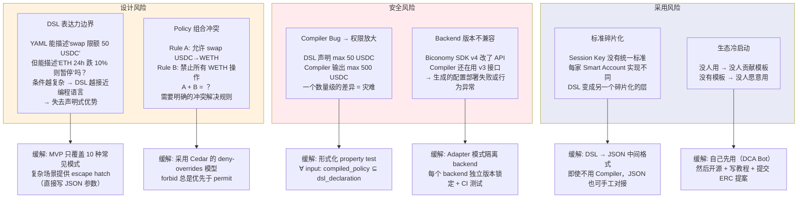

### 6.5 最小验证计划

**目标**：用最少的工程量证明"DSL → Session Key Compiler"这条路径是可行的。

**Week 3 验证计划（7 天）**：

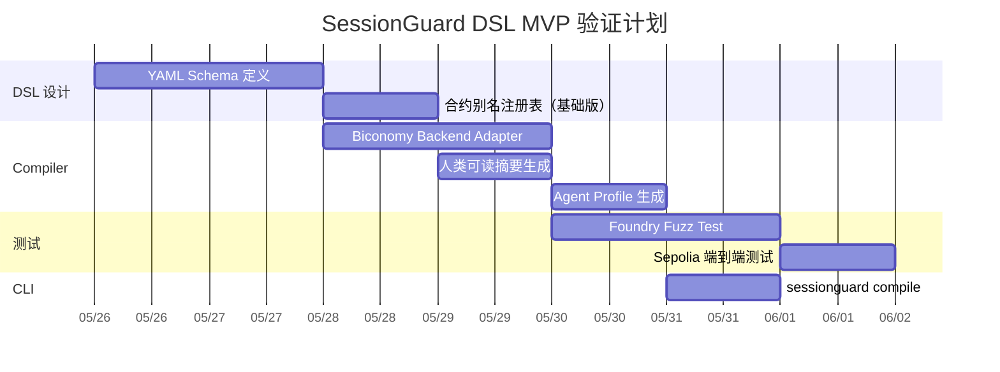

**验证矩阵**：

| 验证项 | 方法 | 通过标准 | 失败时行动 |
|--------|------|----------|-----------|
| DSL 解析正确性 | 10 个预定义 Policy YAML 解析测试 | 100% 解析成功，无歧义 | 修改 Schema |
| Compiler 输出正确性 | Biconomy SDK 可接受的配置格式校验 | 100% 格式合规 | 修改 Adapter |
| 权限不放大 | Fuzz test: random DSL → 编译 → 链上模拟 | 0 个权限放大案例 / 1000 次 fuzz | 修复 Compiler bug |
| 端到端功能 | Sepolia DCA Bot 7 天运行 | 允许操作全通过 + 禁止操作全拦截 | 分析失败原因 |
| 人类可读性 | 3 个非开发者审阅 human-summary.md | 均能正确理解权限范围 | 修改摘要模板 |

---

## 7. 方向 Backlog

以下 3 个方向在 Week 2 研究中深入分析过，有独立的笔记文档，但当前不作为主方向。

### 7.1 Payment — x402 + CAW Agent 自主付费闭环

**研究深度**：已完成 36K 字的深度设计文档（`x402-caw-paywall-agent.md`），包括完整架构、伪代码、风险矩阵。

**为什么不选**：
- x402 协议本身仍在早期（只支持 Base + USDC，upto scheme 未发布），生态太窄
- CAW（Cobo Agentic Wallet）是中心化基础设施，依赖 Cobo 的 MPC 服务——与去信任执行的方向不一致
- Payment 依赖 Permission 作为前置——Agent 必须先有安全的权限控制，才能自主付费

**什么时候可能回来**：
- x402 V2 发布 upto scheme + 支持更多链/token 后
- 自建 Facilitator 的门槛降低后
- SessionGuard DSL 的 Permission 层稳定后，Payment 可以作为上层应用

**保留价值**：x402+CAW 的完整设计可以作为 SessionGuard DSL 的 **示例场景**——用 DSL 定义 x402 付费 Agent 的 Session Key Policy。

### 7.2 Identity — Agent Profile 与链上信誉

**研究深度**：已完成 Agent Profile 草图（`agent-identity-profile.md`），定义了 Identity / Capability / Reputation 三层模型，设计了自增强信任循环。

**为什么不选**：
- Identity 依赖 Permission 和 Payment 的积累——没有链上执行记录就没有信誉数据源
- ERC-8004（Agent ENS Name）还在提案阶段，标准未定
- Identity 更偏向"协议标准设计"而非"可立即构建的工具"——我更倾向先做有工程产出的方向

**什么时候可能回来**：
- SessionGuard DSL 的 Agent Profile JSON 自动生成功能天然连接到 Identity 方向
- 当 DCA Bot 在 Sepolia 上积累了足够的链上执行记录后，可以开始构建基于 EAS attestation 的信誉系统
- ERC-8004 或类似标准有实质性进展后

**保留价值**：Agent Profile JSON 是 SessionGuard DSL Compiler 的标准输出之一。DSL 中定义的 Capability 声明会自动同步到 Profile，保证"声明与链上 Policy 一致"。

### 7.3 Governance / Coordination — 多 Agent 协作治理

**研究深度**：已完成多 Agent DeFi 组合策略的完整协作流程设计（`governance-coordination-flow.md`），包括二级 Session Key 委托模型、争议处理流程、DAO 工具结合点。

**为什么不选**：
- 多 Agent 协作是最高层的问题域，依赖 Permission + Payment + Identity 全部就绪
- 二级 Session Key 委托在当前各家 Smart Account 中都没有标准实现
- 复杂度爆炸：Orchestrator + 子 Agent + 跨协议 + 跨链 = 太多未解决的子问题
- Week 3-4 的时间不足以构建有意义的 MVP

**什么时候可能回来**：
- SessionGuard DSL 支持"嵌套 Policy"（父 Policy 约束子 Policy 的范围）后
- ERC-4337 或 Safe 生态出现二级 Session Key 委托的标准实现后
- 有明确的多 Agent 协作场景需求（如 DAO 资金管理）后

**保留价值**：二级 Session Key 委托模型的设计可以指导 DSL 的 "delegation" 语法扩展——未来 DSL 需要支持"Policy Author 签发的 Policy 可以进一步约束子 Agent"的语义。

### 7.4 Backlog 总结

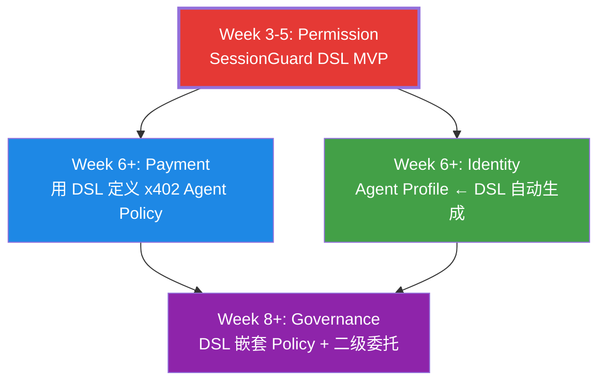

---

## 附录：每日 Check-in 信任栈积累

| 日期 | 主题 | 关键洞察 | 如何指导 DSL 设计 |
|------|------|----------|------------------|
| 5/18 | L2 Capacity | L2 低 gas 让 Session Key 验证的链上成本可接受 | DSL 优先适配 L2 部署 |
| 5/19 | Session Key Permission | Session Key 的 target/selector/value/expiry 四维约束 | DSL 的核心字段映射 |
| 5/20 | Trust Model Inversion | 从"信任 Agent"反转为"约束 Agent" | DSL 默认 deny-all，只声明允许 |
| 5/21 | EntryPoint Validation | validateUserOp 是链上最终防线 | DSL 编译目标是 validateUserOp 可校验的参数 |
| 5/22 | Paymaster Economics | Paymaster 让 Agent 零 ETH 运行 | DSL 需要 gas 策略字段 |
| 5/23 | Expressiveness vs Containment | 表达力越强风险越大 | DSL 有意限制表达力，保证可分析性 |
| 5/24 | On-chain Reputation | 链上记录是信誉的数据源 | DSL 编译输出包含 Agent Profile |
| 5/25 | Minimal Experiment Design | 最小验证优先于完美设计 | MVP 只做 Biconomy backend + DCA Bot 场景 |
