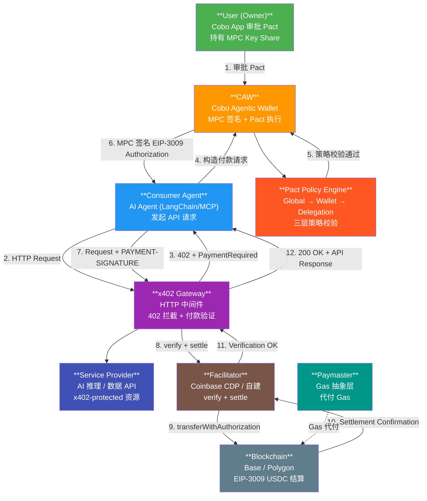
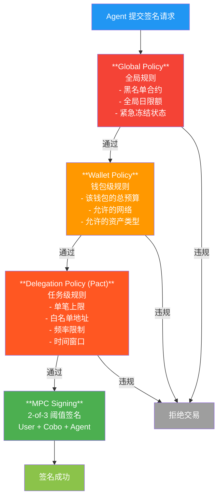
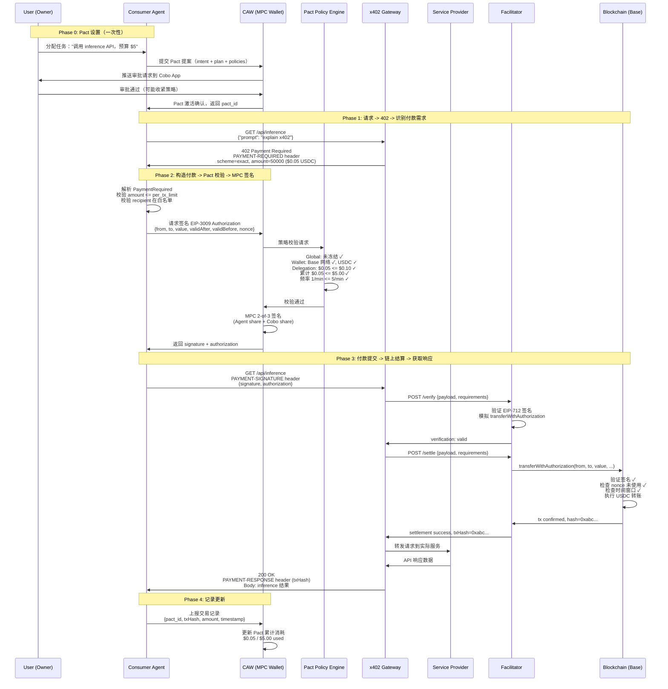
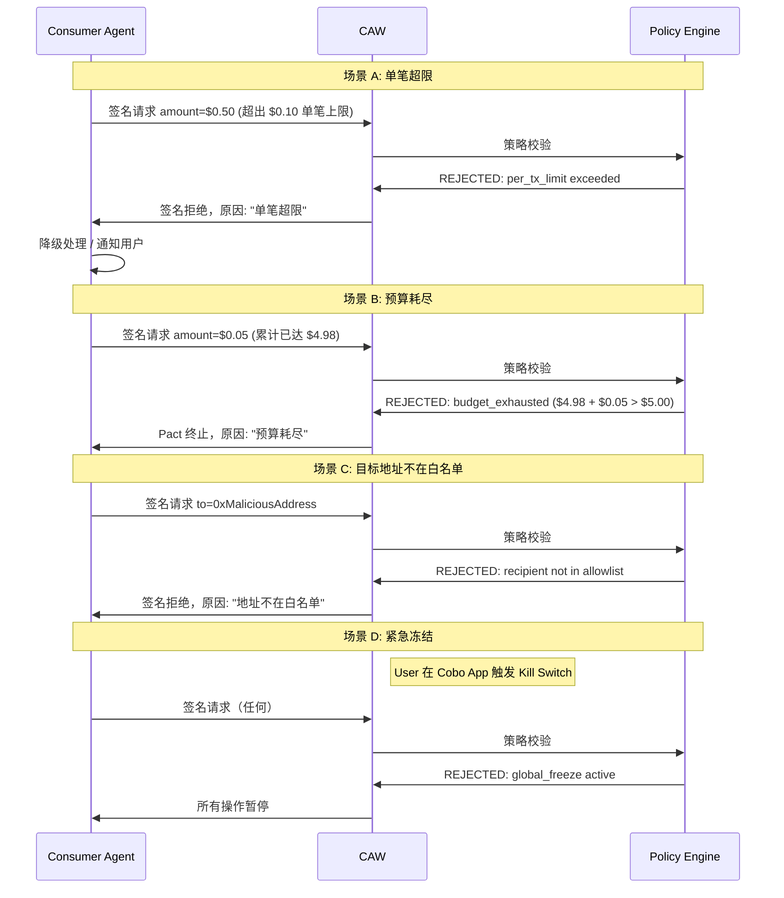
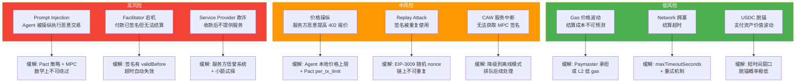

# x402 Paywall + Cobo CAW Agent 自主付费闭环设计

> Week 2 Advanced Task (40 credits)
> 设计一个最小化 x402 paywall + Cobo Agentic Wallet (CAW) 的 Agent 自主付费闭环方案。
> 核心命题：不是"自动付款"，而是在**显式授权、预算管控、可审计记录**下完成自动化交易。

---

## 目录

1. [系统架构总览](#1-系统架构总览)
2. [x402 协议深度拆解](#2-x402-协议深度拆解)
3. [Cobo CAW / Pact 机制详解](#3-cobo-caw--pact-机制详解)
4. [完整交互流程](#4-完整交互流程)
5. [关键组件伪代码](#5-关键组件伪代码)
6. [可审计记录结构](#6-可审计记录结构)
7. [风险边界与缓解](#7-风险边界与缓解)
8. [方案对比：x402+CAW vs 传统方案](#8-方案对比x402caw-vs-传统方案)
9. [设计决策与未解问题](#9-设计决策与未解问题)

---

## 1. 系统架构总览

### 1.1 参与者清单

| 角色 | 职责 | 信任等级 |
|------|------|----------|
| **Service Provider** | 提供 x402-protected API / AI 推理服务 | 半信任（提供服务但可能宕机） |
| **x402 Gateway** | 中间件层，拦截请求、返回 402、验证付款 | 半信任（Facilitator 角色） |
| **Facilitator** | 验证 PaymentPayload 签名，提交链上结算 | 半信任（Coinbase CDP 或自建） |
| **Consumer Agent** | AI Agent，发起请求、识别 402、构造付款 | 不信任（可能被 prompt injection） |
| **CAW (Cobo Agentic Wallet)** | MPC 钱包，执行 Pact 策略，签名交易 | 信任（基础设施层强制执行） |
| **Pact Policy Engine** | 三层策略引擎 (global -> wallet -> delegation) | 信任（密码学强制） |
| **User (Owner)** | 审批 Pact、持有 MPC key share、紧急冻结 | 最高信任（最终控制权） |
| **Blockchain (Base/Polygon)** | 结算层，EIP-3009 transferWithAuthorization | 去信任（共识保证） |
| **Paymaster (可选)** | Gas 抽象，Agent 钱包无需持有原生代币 | 半信任（可替换） |

### 1.2 架构拓扑图



### 1.3 核心设计原则

**三层分离**，对应 Week 2 学习的 AA 架构映射：

| 层 | AA 概念 | 本方案映射 | 作用 |
|----|---------|-----------|------|
| Permission Layer | Session Key | **Pact** (intent + policy + completion) | 定义 Agent 能做什么 |
| Execution Layer | EntryPoint.validateUserOp | **CAW Policy Engine** + MPC 签名 | 每笔交易原子级校验 |
| Economic Layer | Paymaster | **Paymaster** + EIP-3009 | Gas 抽象 + 零余额 Agent 钱包 |

---

## 2. x402 协议深度拆解

### 2.1 协议本质

x402 把 HTTP/1.1 规范中从 1999 年预留但从未实现的 `402 Payment Required` 状态码激活为一个完整的机器对机器结算层。核心思路：**让支付像 HTTP 请求一样原生**。

不需要 API Key、不需要账户注册、不需要月度发票。一个 Agent 可以为一次 API 调用支付零点几美分。

### 2.2 四步交互流程

```
Client ──GET /api/inference──> Resource Server
       <──402 + PAYMENT-REQUIRED header──

Client 解析 PaymentRequired，选择 scheme + network
Client 签名 EIP-3009 Authorization

Client ──GET /api/inference + PAYMENT-SIGNATURE header──> Resource Server
       ──POST /verify──> Facilitator (校验签名)
       ──POST /settle──> Facilitator (链上结算)
       <──transferWithAuthorization──> Blockchain

       <──200 OK + PAYMENT-RESPONSE + Body──
```

### 2.3 三个关键 HTTP Header

#### PAYMENT-REQUIRED (Server -> Client)

服务端返回 402 时携带，告知客户端需要支付什么、付多少、付到哪里。

```json
{
  "x402Version": 2,
  "resource": {
    "url": "/api/inference",
    "description": "GPT-4 level inference, 1000 tokens",
    "mimeType": "application/json"
  },
  "accepted": [
    {
      "scheme": "exact",
      "network": "eip155:8453",
      "amount": "50000",
      "asset": "0x833589fCD6eDb6E08f4c7C32D4f71b54bdA02913",
      "payTo": "0xServiceProviderAddress",
      "maxTimeoutSeconds": 30,
      "extra": {
        "assetTransferMethod": "eip3009"
      }
    }
  ]
}
```

**关键字段解析**：
- `scheme: "exact"` — 精确支付，V1 唯一支持的 scheme。理论上还有 `upto`（按消耗计费，适合 LLM token 计费）
- `network: "eip155:8453"` — CAIP-2 格式，8453 = Base Mainnet
- `amount: "50000"` — USDC 6 位小数，50000 = $0.05
- `asset` — USDC 合约地址
- `extra.assetTransferMethod: "eip3009"` — 使用 EIP-3009 transferWithAuthorization

#### PAYMENT-SIGNATURE (Client -> Server)

客户端重新发起请求时携带的付款凭证。

```json
{
  "x402Version": 2,
  "scheme": "exact",
  "network": "eip155:8453",
  "payload": {
    "signature": "0x...(EIP-712 typed data signature)",
    "authorization": {
      "from": "0xAgentWalletAddress",
      "to": "0xServiceProviderAddress",
      "value": "50000",
      "validAfter": 1716600000,
      "validBefore": 1716600030,
      "nonce": "0x...(random bytes32)"
    }
  }
}
```

**EIP-3009 要点**：
- `nonce` 是随机 bytes32 而非顺序计数器 — 允许并行构造多个授权不冲突
- `validAfter` / `validBefore` — 时间窗口限制，过期自动失效
- 签名后 Agent 不直接发交易，而是把签名交给 Facilitator 提交链上

#### PAYMENT-RESPONSE (Server -> Client)

200 OK 时携带，包含结算结果。

```json
{
  "success": true,
  "transactionHash": "0xabc...def",
  "network": "eip155:8453",
  "payer": "0xAgentWalletAddress"
}
```

### 2.4 EIP-3009 为什么是关键

EIP-3009 `transferWithAuthorization` 实现了**签名授权 + 第三方提交**的分离：

1. Agent 签名授权（"我同意从我的地址转 X 个 USDC 到 Y 地址"）
2. Facilitator 提交交易（调用合约的 `transferWithAuthorization`）
3. 链上合约验证签名、执行转账

**好处**：Agent 不需要持有 ETH/原生代币来支付 Gas。签名是离链操作，Gas 由 Facilitator 承担（或通过 Paymaster 抽象）。

**限制**：目前只有 USDC 和 EURC 原生支持 EIP-3009。Permit2 作为 fallback 可以覆盖其他 ERC-20，但 98.7% 的 x402 交易量用的还是 USDC。

---

## 3. Cobo CAW / Pact 机制详解

### 3.1 CAW vs 传统 Session Key 对比

| 维度 | 原始 Session Key | Cobo CAW Pact |
|------|-----------------|---------------|
| **权限定义** | 静态配置（allowedMethods, spendingLimit） | 动态生成（每个任务独立 Pact） |
| **生命周期** | 手动创建/撤销 | 任务完成自动终止 |
| **执行约束** | 合约层校验 | MPC 签名层 + 三层策略引擎 |
| **被绕过风险** | Agent runtime 被攻破可绕过 | MPC 分片密钥，数学上不可绕过 |
| **意图表达** | 无（纯技术参数） | 有（intent + execution plan） |
| **审计粒度** | 交易级别 | 任务级别（Pact 全生命周期） |

核心区别：**Session Key 是"允许列表"，Pact 是"任务合同"**。

Session Key 说："你可以调用这些方法，花这么多钱，在这个时间之前。"
Pact 说："你的任务是在 Aave 上做收益耕作，具体步骤是 1-2-3，预算 $100，滑点不超过 0.5%，30 天后自动终止，或者预算花完自动终止。"

### 3.2 Pact 结构定义

```yaml
Pact:
  id: "pact_x402_inference_20260525"
  version: 1

  intent:
    description: "Consumer Agent 通过 x402 协议付费调用 AI 推理 API"
    category: "api_payment"

  execution_plan:
    steps:
      - step: 1
        action: "发起 HTTP 请求到 x402-protected endpoint"
        contract_interaction: false
      - step: 2
        action: "接收 402 响应，解析 PaymentRequired"
        contract_interaction: false
      - step: 3
        action: "构造 EIP-3009 Authorization 并请求 CAW 签名"
        contract_interaction: true
        target_contract: "0x833589fCD6eDb6E08f4c7C32D4f71b54bdA02913"
        method: "transferWithAuthorization"
      - step: 4
        action: "携带 PAYMENT-SIGNATURE 重发请求，获取 API 响应"
        contract_interaction: false

  policies:
    budget:
      max_total: "5000000"          # $5 USDC 总预算
      max_per_transaction: "100000"  # $0.10 单笔上限
      asset: "USDC"
      network: "eip155:8453"        # Base only
    scope:
      allowed_contracts:
        - "0x833589fCD6eDb6E08f4c7C32D4f71b54bdA02913"  # USDC on Base
      allowed_methods:
        - "transferWithAuthorization"
      allowed_recipients:
        - "0xServiceProviderAddress"
      blocked_contracts: "*"         # 除白名单外全部禁止
    time:
      valid_from: "2026-05-25T00:00:00Z"
      valid_until: "2026-05-26T00:00:00Z"  # 24 小时窗口
    rate_limit:
      max_transactions_per_hour: 60
      max_transactions_per_minute: 5

  completion_conditions:
    - type: "budget_exhausted"
      trigger: "total_spent >= max_total"
    - type: "time_expired"
      trigger: "now >= valid_until"
    - type: "task_complete"
      trigger: "agent_reports_done"
    - type: "manual_revoke"
      trigger: "user_kills_pact"
```

### 3.3 三层策略引擎



**关键点**：策略不是在 Agent 软件层检查的，而是在 MPC 签名基础设施层强制执行的。即使 Agent 被 prompt injection 攻击，也**数学上不可能**绕过策略生成有效签名。

### 3.4 MPC 密钥分片

```
User Key Share (1/3) ── 用户手机 Cobo App
Cobo Key Share (1/3) ── Cobo 基础设施（执行策略引擎）
Agent Key Share (1/3) ── Agent 运行环境

签名阈值：2-of-3
```

- Agent 单独无法签名（只有 1/3）
- Agent + Cobo 可以签名，但 Cobo 会强制执行 Pact 策略
- User 可以随时冻结所有子钱包，撤销所有活跃 Pact（Kill Switch）

---

## 4. 完整交互流程

### 4.1 主流程 Sequence Diagram



### 4.2 异常流程



---

## 5. 关键组件伪代码

### 5.1 Agent Payment Handler

```python
class X402PaymentHandler:
    """Agent 侧的 x402 付款处理器"""

    def __init__(self, caw_client: CoboCawClient, pact_id: str):
        self.caw = caw_client
        self.pact_id = pact_id
        self.session_spent = 0

    async def request_with_payment(self, url: str, method: str = "GET",
                                     body: dict = None) -> Response:
        # Step 1: 发起初始请求
        response = await http_request(url, method, body)

        if response.status_code != 402:
            return response  # 不需要付款，直接返回

        # Step 2: 解析 PaymentRequired
        payment_req = self._parse_payment_required(
            response.headers["PAYMENT-REQUIRED"]
        )

        # Step 3: 本地预校验（减少无效签名请求）
        self._local_precheck(payment_req)

        # Step 4: 选择支付方案
        selected = self._select_payment_option(payment_req["accepted"])

        # Step 5: 构造 EIP-3009 Authorization
        authorization = {
            "from": self.caw.agent_address,
            "to": selected["payTo"],
            "value": selected["amount"],
            "validAfter": int(time.time()),
            "validBefore": int(time.time()) + selected["maxTimeoutSeconds"],
            "nonce": generate_random_bytes32()
        }

        # Step 6: 请求 CAW 签名（Pact 策略在此校验）
        try:
            signature = await self.caw.sign_eip3009(
                pact_id=self.pact_id,
                authorization=authorization
            )
        except PactViolationError as e:
            # 策略被拒 — 不重试，不绕过
            logger.warning(f"Pact violation: {e.reason}")
            raise AgentPaymentDenied(e.reason)

        # Step 7: 构造 PAYMENT-SIGNATURE header
        payment_payload = base64_encode({
            "x402Version": 2,
            "scheme": "exact",
            "network": selected["network"],
            "payload": {
                "signature": signature,
                "authorization": authorization
            }
        })

        # Step 8: 重新发起请求（携带付款凭证）
        response = await http_request(
            url, method, body,
            headers={"PAYMENT-SIGNATURE": payment_payload}
        )

        # Step 9: 记录交易
        if response.status_code == 200:
            payment_response = self._parse_payment_response(
                response.headers.get("PAYMENT-RESPONSE")
            )
            await self._record_payment(authorization, payment_response)
            self.session_spent += int(selected["amount"])

        return response

    def _local_precheck(self, payment_req: dict):
        """本地预校验，避免向 CAW 发送注定被拒的请求"""
        for option in payment_req["accepted"]:
            amount = int(option["amount"])
            if amount > MAX_PER_TX:
                continue
            if self.session_spent + amount > MAX_TOTAL_BUDGET:
                continue
            if option["payTo"] not in ALLOWED_RECIPIENTS:
                continue
            return  # 至少有一个可选方案

        raise AgentPaymentDenied("No acceptable payment option found")

    def _select_payment_option(self, options: list) -> dict:
        """选择最优支付方案：优先 Base 网络 + eip3009"""
        for opt in options:
            if opt["network"] == "eip155:8453":       # Base
                if opt.get("extra", {}).get("assetTransferMethod") == "eip3009":
                    return opt
        # Fallback: 第一个 EVM 方案
        for opt in options:
            if opt["network"].startswith("eip155:"):
                return opt
        raise AgentPaymentDenied("No supported network found")

    async def _record_payment(self, authorization: dict,
                                payment_response: dict):
        """记录付款到 CAW 审计日志"""
        await self.caw.report_transaction(
            pact_id=self.pact_id,
            record={
                "tx_hash": payment_response["transactionHash"],
                "amount": authorization["value"],
                "recipient": authorization["to"],
                "network": payment_response["network"],
                "timestamp": int(time.time()),
                "status": "settled"
            }
        )
```

### 5.2 Pact Policy Definition

```python
def create_x402_inference_pact(
    service_provider_address: str,
    total_budget_usdc: int,
    per_tx_limit_usdc: int,
    duration_hours: int = 24,
    rate_limit_per_hour: int = 60
) -> Pact:
    """创建用于 x402 API 付费的 Pact"""

    now = int(time.time())

    return Pact(
        intent=PactIntent(
            description="通过 x402 协议付费调用 AI 推理 API",
            category="api_payment",
            risk_level="low"
        ),
        execution_plan=ExecutionPlan(
            steps=[
                Step(1, "HTTP request to x402 endpoint"),
                Step(2, "Parse 402 PaymentRequired response"),
                Step(3, "Sign EIP-3009 transferWithAuthorization"),
                Step(4, "Submit payment and receive API response"),
            ]
        ),
        policies=PactPolicies(
            budget=BudgetPolicy(
                max_total=total_budget_usdc * 10**6,    # USDC 6 decimals
                max_per_transaction=per_tx_limit_usdc * 10**6,
                asset="USDC",
                networks=["eip155:8453"]                 # Base only
            ),
            scope=ScopePolicy(
                allowed_contracts=[
                    USDC_BASE_ADDRESS,                   # USDC on Base
                ],
                allowed_methods=["transferWithAuthorization"],
                allowed_recipients=[service_provider_address],
                blocked_contracts="*"
            ),
            time=TimePolicy(
                valid_from=now,
                valid_until=now + duration_hours * 3600
            ),
            rate_limit=RateLimitPolicy(
                max_per_hour=rate_limit_per_hour,
                max_per_minute=5
            )
        ),
        completion_conditions=[
            CompletionCondition("budget_exhausted"),
            CompletionCondition("time_expired"),
            CompletionCondition("task_complete"),
            CompletionCondition("manual_revoke"),
        ]
    )
```

### 5.3 x402 Gateway Middleware

```typescript
// Express.js x402 middleware（服务提供方侧）

import { createPaymentMiddleware } from "@x402/express";

interface X402Config {
  facilitatorUrl: string;     // Coinbase CDP 或自建 Facilitator
  payTo: string;              // 服务方收款地址
  network: string;            // "eip155:8453" (Base)
  asset: string;              // USDC 合约地址
}

function x402Paywall(config: X402Config) {
  return async (req: Request, res: Response, next: NextFunction) => {
    // 检查是否携带 PAYMENT-SIGNATURE
    const paymentSig = req.headers["payment-signature"];

    if (!paymentSig) {
      // 返回 402，告知付款要求
      const paymentRequired = {
        x402Version: 2,
        resource: {
          url: req.originalUrl,
          description: getResourceDescription(req),
          mimeType: "application/json"
        },
        accepted: [{
          scheme: "exact",
          network: config.network,
          amount: calculatePrice(req).toString(),  // 动态定价
          asset: config.asset,
          payTo: config.payTo,
          maxTimeoutSeconds: 30,
          extra: { assetTransferMethod: "eip3009" }
        }]
      };

      res.status(402)
         .header("PAYMENT-REQUIRED", base64Encode(paymentRequired))
         .json({ error: "Payment Required" });
      return;
    }

    // 验证付款
    try {
      const payload = base64Decode(paymentSig);
      const requirements = buildRequirements(req, config);

      // 通过 Facilitator 验证
      const verification = await fetch(`${config.facilitatorUrl}/verify`, {
        method: "POST",
        body: JSON.stringify({ payload, requirements })
      });

      if (!verification.ok) {
        res.status(402).json({ error: "Payment verification failed" });
        return;
      }

      // 通过 Facilitator 结算
      const settlement = await fetch(`${config.facilitatorUrl}/settle`, {
        method: "POST",
        body: JSON.stringify({ payload, requirements })
      });

      const result = await settlement.json();

      if (!result.success) {
        res.status(402).json({ error: "Payment settlement failed" });
        return;
      }

      // 付款成功，附加结算信息到响应
      res.header("PAYMENT-RESPONSE", base64Encode(result));

      // 记录链下审计日志
      await logPayment({
        txHash: result.transactionHash,
        payer: payload.payload.authorization.from,
        amount: payload.payload.authorization.value,
        resource: req.originalUrl,
        timestamp: Date.now(),
        network: config.network
      });

      next();  // 放行到实际业务处理
    } catch (err) {
      res.status(500).json({ error: "Payment processing error" });
    }
  };
}

function calculatePrice(req: Request): number {
  // 动态定价示例：根据模型和 token 数定价
  const model = req.body?.model || "default";
  const maxTokens = req.body?.max_tokens || 1000;

  const pricePerToken: Record<string, number> = {
    "gpt4-level": 50,      // $0.00005 per token
    "default": 10,          // $0.00001 per token
  };

  return (pricePerToken[model] || 10) * maxTokens;
}

// 使用
app.use("/api/inference", x402Paywall({
  facilitatorUrl: "https://x402.coinbase.com",
  payTo: "0xServiceProviderAddress",
  network: "eip155:8453",
  asset: USDC_BASE_ADDRESS
}));

app.post("/api/inference", async (req, res) => {
  // 到达这里说明付款已完成
  const result = await runInference(req.body.prompt);
  res.json({ result });
});
```

---

## 6. 可审计记录结构

### 6.1 链上记录 (On-chain)

链上记录是**不可篡改的事实来源**。

| 数据 | 来源 | 内容 |
|------|------|------|
| **USDC Transfer Event** | EIP-3009 合约 | `Transfer(from, to, value)` event log |
| **Transaction Hash** | Base 区块链 | 交易的唯一标识，包含完整的 calldata |
| **Nonce 消耗** | EIP-3009 合约 | `AuthorizationUsed(authorizer, nonce)` event |
| **Block Timestamp** | Base 区块链 | 精确到秒的结算时间 |
| **Gas 记录** | Base 区块链 | Facilitator / Paymaster 的 gas 消耗 |

```solidity
// 链上可查询的关键 Event
event Transfer(address indexed from, address indexed to, uint256 value);
event AuthorizationUsed(address indexed authorizer, bytes32 indexed nonce);
```

### 6.2 CAW 侧记录 (Off-chain, Cobo Infrastructure)

| 数据 | 内容 |
|------|------|
| **Pact 生命周期** | 创建、审批、激活、暂停、终止 |
| **策略校验日志** | 每次签名请求的三层策略校验结果 |
| **累计消耗跟踪** | Pact 内已消耗预算 / 剩余预算 |
| **被拒交易记录** | 被策略拒绝的请求（含拒绝原因） |
| **MPC 签名日志** | 签名参与方、时间、关联 Pact |

### 6.3 Agent 侧记录 (Off-chain, Agent Runtime)

| 数据 | 内容 |
|------|------|
| **请求-付款映射** | 哪个 API 请求触发了哪笔付款 |
| **402 响应原文** | PaymentRequired 的完整内容 |
| **付款决策日志** | 为什么选择这个支付方案 |
| **API 响应摘要** | 付费获取的资源的 hash / 摘要 |
| **成本效益记录** | 单次调用成本 vs 获取的价值 |

### 6.4 Service Provider 侧记录 (Off-chain)

| 数据 | 内容 |
|------|------|
| **收款记录** | txHash + amount + payer address |
| **资源交付记录** | 交付了什么、给谁、什么时间 |
| **定价日志** | 当时的定价参数 |

### 6.5 审计完整性：交叉验证

```
链上 Transfer Event
    ↕ 交叉验证
CAW Pact 签名日志
    ↕ 交叉验证
Agent 请求-付款映射
    ↕ 交叉验证
Service Provider 收款记录
```

任何一方的记录都可以用其他方的记录交叉验证。链上记录是终极裁判。

**Agent 信誉/信用分**的基础（呼应 Week 2 学习笔记）：

链上执行记录可以构成 Agent 的信誉系统：
- 交易频率 + 金额 → 活跃度
- Pact 遵守率（被拒次数 / 总请求次数）→ 合规度
- 付款及时性（validBefore 之前完成）→ 可靠度
- 服务方评价（是否正常消费资源）→ 消费信用

---

## 7. 风险边界与缓解

### 7.1 风险矩阵



### 7.2 详细风险分析

#### R1: Prompt Injection (高风险)

**攻击场景**：恶意输入操纵 Agent 向攻击者地址付款。

**缓解**：
- Pact `allowed_recipients` 白名单 — Agent 即使被操纵，CAW 也会拒绝向非白名单地址签名
- `max_per_transaction` 上限 — 即使目标地址正确，单笔也不会超限
- MPC 2-of-3 — Agent 无法单独签名
- **这是 CAW 相比纯 Session Key 的核心优势**

#### R2: Facilitator 宕机 (高风险)

**攻击场景**：Agent 已签名 Authorization，但 Facilitator 无法提交链上结算。

**缓解**：
- EIP-3009 Authorization 有 `validBefore` 时间戳 — 超时自动失效
- 签名不等于扣款 — 只有链上执行才会转移资产
- 可以配置备用 Facilitator

#### R3: Service Provider 欺诈 (高风险)

**攻击场景**：服务方收到 USDC 后不提供 API 响应。

**缓解**：
- x402 协议本身没有退款机制（Web3 不可逆的本质）
- 缓解策略：小额试探（先 $0.01 测试），服务方信誉评分，Agent 记录服务方的交付率
- **产品路径**（呼应学习笔记）：保守开放 → 逐步信任 → intent-driven

#### R4: 价格操纵 (中风险)

**攻击场景**：服务方在 402 响应中报出异常高价。

**缓解**：
- Agent 本地预校验 `amount <= MAX_PER_TX`
- Pact 策略层二次校验
- Agent 可以维护历史价格基线，异常波动时拒绝

#### R5: Replay Attack (中风险)

**攻击场景**：截获 PAYMENT-SIGNATURE 后重放。

**缓解**：
- EIP-3009 使用随机 bytes32 nonce，链上合约记录已使用的 nonce
- `AuthorizationUsed` event 永久记录
- 即使重放签名，合约层会拒绝（nonce already used）

---

## 8. 方案对比：x402+CAW vs 传统方案

| 维度 | 传统 API Key 计费 | Stripe-style 支付 | **x402 + CAW** |
|------|-------------------|-------------------|----------------|
| **身份要求** | 注册账号 + API Key | 注册账号 + 绑卡 | 无需注册，只需钱包地址 |
| **最小支付粒度** | 月度/预付包 | $0.50 (Stripe 最低) | $0.00001 (链上 gas 成本为下限) |
| **结算速度** | T+30 天 | T+2 天 | 秒级（L2 确认） |
| **跨境摩擦** | 高（不同支付网关） | 中（Stripe 全球但有地域限制） | 无（链上无国界） |
| **Agent 可用性** | 低（需要人工注册） | 低（需要信用卡） | **高（原生机器对机器）** |
| **预算控制** | API quota 限制 | 信用卡额度 | **Pact 多维策略** |
| **可审计性** | 平台日志（可篡改） | 平台日志（可篡改） | **链上不可篡改** |
| **授权模型** | 全权限 API Key | 全权限信用卡 | **Pact 任务级授权** |
| **退款/争议** | 有 | 有（chargeback） | **无（不可逆）** |
| **匿名性** | 无 | 无 | 伪匿名（链上地址） |
| **中心化依赖** | 服务方平台 | Stripe + 银行 | Facilitator（可替换） |

### 核心权衡

**x402+CAW 的优势**：Agent-native、微支付、链上审计、任务级授权。

**x402+CAW 的劣势**：不可逆（无 chargeback）、USDC 依赖、需要链上基础设施。

**适用场景**：AI Agent 自主调用 API、微支付、跨境 M2M 交易。
**不适用场景**：大额消费（需要退款保护）、法币场景、非技术用户。

### 信任模型对比（呼应 Week 2 学习）

```
Web2 信任模型:  可信中介 → 可逆交易 → 事后争议解决
Web3 信任模型:  公开无信任 → 不可逆交易 → 事前策略约束

x402+CAW 的选择: 用 Pact 做事前约束，用链上记录做事后审计
                 弥补"不可逆"的风险，同时保留"无信任"的优势
```

---

## 9. 设计决策与未解问题

### 9.1 关键设计决策

| 决策 | 选择 | 理由 |
|------|------|------|
| 结算网络 | Base (eip155:8453) | 低 gas、USDC 原生支持 EIP-3009、Coinbase 生态 |
| 支付资产 | USDC | x402 主流（98.7% 交易量）、EIP-3009 原生支持 |
| 签名方式 | EIP-3009 + EIP-712 | 离链签名、Agent 不需要 ETH、Facilitator 代提交 |
| 授权框架 | Cobo CAW Pact | 基础设施层强制（vs Session Key 合约层强制） |
| Facilitator | Coinbase CDP 托管 | 免费额度 1000 tx/月、后续可切换到自建 |

### 9.2 未解问题

**1. x402 `upto` scheme 何时可用？**
当前只有 `exact` scheme 可用。对 LLM 推理这种按 token 计费的场景，`upto` scheme（先授权上限，按实际消耗扣费）更合理。但 V2 规范中还未正式发布。

**2. Pact 策略的动态调整**
如果 Agent 发现某个 API 涨价了，能否自动调整 Pact 的 `per_tx_limit`？还是必须走 User 审批？当前设计是后者（安全第一），但这引入了延迟。

**3. 多 Agent 协作场景**
如果 Agent A 需要调用 Agent B 的服务（Agent B 也是 x402 服务提供方），Pact 如何表达这种嵌套授权？

**4. Facilitator 的中心化风险**
x402 协议声称去中心化，但 Facilitator 是一个中心化节点。如果 Coinbase CDP 审查某些交易怎么办？自建 Facilitator 的成本和门槛？

**5. 链下记录的可信度**
Agent 侧和 Service Provider 侧的记录是链下的，可以被篡改。如何建立跨方的审计共识？一种思路是把关键记录的 hash 锚定到链上（anchor on-chain），但增加了 gas 成本。

### 9.3 演进路径

```
Phase 1 (当前设计): 单 Agent + 单 Service Provider + Coinbase Facilitator
    → 最小可行闭环，验证核心流程

Phase 2: 多 Service Provider + 动态发现
    → Agent 自动发现并比价多个 x402 服务方
    → Pact 支持多个 allowed_recipients

Phase 3: Agent-to-Agent 支付
    → Agent B 也是 x402 服务提供方
    → 嵌套 Pact / 子 Pact 授权

Phase 4: 信誉系统 + Intent-driven
    → 链上交易记录构成 Agent 信用评分
    → 高信誉 Agent 获得更高预算限额
    → 从"保守开放"走向"intent-driven"自治
```

---

## 参考资料

- [x402 Protocol Official Site](https://www.x402.org/)
- [x402 Specification (GitHub)](https://github.com/coinbase/x402/blob/main/specs/x402-specification.md)
- [x402 Coinbase Developer Documentation](https://docs.cdp.coinbase.com/x402/welcome)
- [Cobo Agentic Wallet (CAW)](https://www.cobo.com/agentic-wallet)
- [Cobo CAW: MPC-Based Security Standard for AI Agents](https://www.cobo.com/post/cobo-agentic-wallet-a-new-paradigm-for-autonomous-ai-agent-transactions-and-payments)
- [EIP-3009: Transfer With Authorization](https://eips.ethereum.org/EIPS/eip-3009)
- [x402 Exact Scheme EVM Spec](https://github.com/coinbase/x402/blob/main/specs/schemes/exact/scheme_exact_evm.md)
- [Cloudflare x402 Foundation Announcement](https://blog.cloudflare.com/x402/)
- [x402 V2 Launch](https://www.x402.org/writing/x402-v2-launch)
